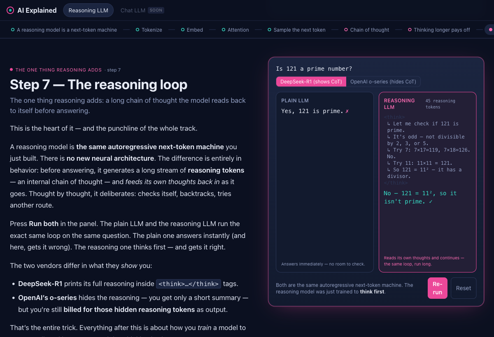

# AI Explained

An open-source, **interactive, scroll-driven** explainer for how AI models
actually work. You scroll; things happen; you learn. The first track teaches
**how a reasoning LLM thinks** (o1 / DeepSeek-R1 style) — from raw text, through
tokenization, embeddings, attention and sampling, to the long chain-of-thought
loop that makes a "reasoning" model reason.

It is built so that **more model types are additive**: image generators, video
generators, mixture-of-experts, self-driving perception, and more are modeled as
different *paths through a shared library of scenes*. Switching models keeps the
familiar parts and spotlights what changed.



> Design docs live in [`docs/explorations/`](docs/explorations/):
> [0001 architecture](docs/explorations/0001_%5B_%5D_INTERACTIVE_SCROLLYTELLING_ARCHITECTURE.md) ·
> [0002 taxonomy & shared scenes](docs/explorations/0002_%5B_%5D_MODEL_TAXONOMY_AND_SHARED_SCENE_ARCHITECTURE.md) ·
> [0003 MVP](docs/explorations/0003_%5B_%5D_MVP_REASONING_LLM_TRACK.md)

## Stack

- **[Astro](https://astro.build)** (islands architecture) — near-zero baseline JS;
  heavy visuals hydrate only when scrolled into view.
- **[Tailwind CSS 4](https://tailwindcss.com)** — styling + a color grammar
  (shared=teal, unique=magenta, weights=amber, data=blue).
- **[React](https://react.dev)** islands for the interactive visualizations.
- **[Scrollama](https://github.com/russellsamora/scrollama)** for the
  sticky-graphic + scrolling-steps pattern.
- **[gpt-tokenizer](https://www.npmjs.com/package/gpt-tokenizer)** for the live,
  in-browser tokenizer (no model download).
- Content authored in **MDX** via Astro **content collections**.

## Develop

```bash
npm install
npm run dev        # http://localhost:4321/ai-explained
npm run build      # static output → dist/
npm run preview    # serve the production build locally
```

> The dev/preview server serves under the base path `/ai-explained`.

## How it's organized (the scene graph)

Content is a **scene registry** plus **track** definitions. A track (a model
type) is an ordered *path* through scenes. Shared scenes are authored once and
reused; each track highlights its one distinctive scene.

```
src/
  content/
    scenes/*.mdx            # narration per scene (frontmatter picks the island)
    tracks/*.json           # ordered path of scene refs; marks the unique "core"
  components/
    SceneScaffold.astro     # sticky graphic + scrolling narration
    PipelineRail.tsx        # shows shared (dim) vs unique (highlighted) scenes
    islands/                # the interactive visualizations (client:visible)
  data/                     # precomputed values for illustrative visuals
  pages/[track].astro       # renders any track from the registry
```

## Add a new model track

The whole point of the architecture: adding a model type should not require
touching shared scenes.

1. **Reuse shared scenes** (`tokenize`, `embed`, `transformer-block`, `sample`)
   by referencing them in your track's `path`.
2. **Author only the scenes that are new** to your model in
   `src/content/scenes/` and register their island in
   `src/components/islands/registry.ts`.
3. **Create `src/content/tracks/<your-model>.json`** — an ordered `path` of
   scene refs, with `highlight: true` on your model's one distinctive scene.
4. Add it to the tab bar order. Done — the route `/<your-model>` builds itself.

See `src/content/tracks/chat-llm.json` for a minimal example that reuses the
reasoning track's shared spine.

## Deploy (GitHub Pages)

Pushing to `main` triggers [`.github/workflows/deploy.yml`](.github/workflows/deploy.yml)
(Astro build → Pages). In the repo **Settings → Pages**, set **Source = GitHub
Actions**. `base` is `/ai-explained` (the repo name) — for a user page or custom
domain set `BASE_PATH=/` and `SITE_URL` in the workflow env.

## Honesty about the demos

- The **tokenizer** and **temperature/top-p sampling** are computed **live** in
  your browser — real numbers you can poke.
- **Attention** and **embedding** visuals use **precomputed** values from GPT-2
  small (see `scripts/precompute.mjs`); regenerate them with `npm run precompute`.
- Facts about proprietary models (o1/o3 internals) are labeled as inferred; the
  chain-of-thought a model shows is **not** a guaranteed transcript of its real
  reasoning — the site teaches this caveat explicitly.

## License

[MIT](LICENSE).
