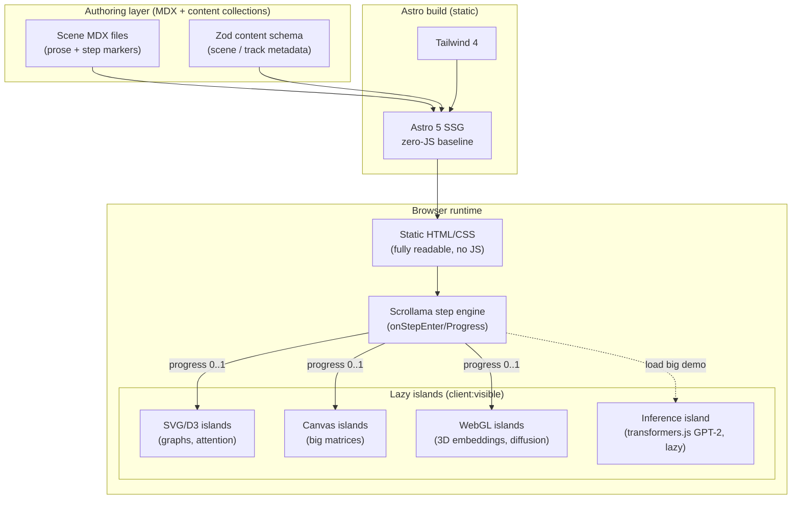
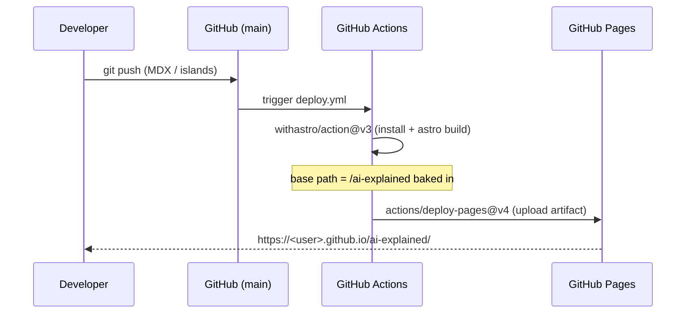
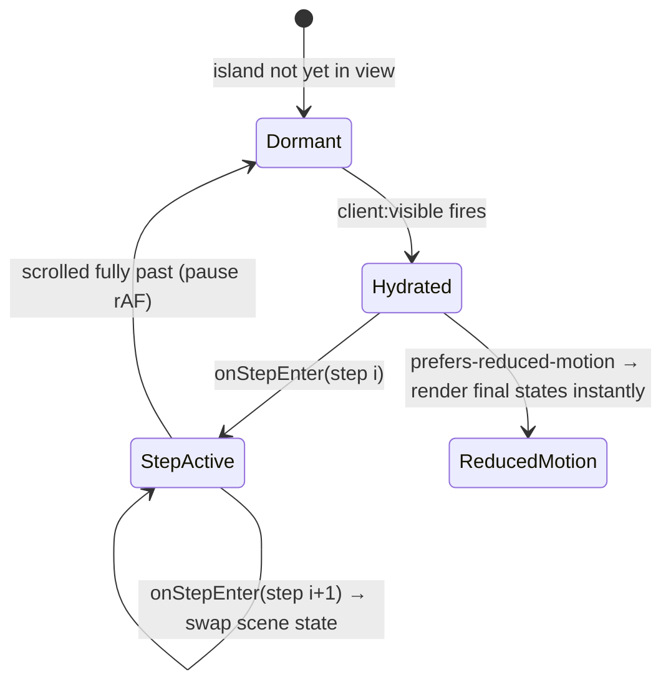

# Interactive Scrollytelling Architecture for "AI Explained"

## Problem Statement

We want to build an open-source website — hosted on **GitHub Pages** — that
teaches how AI works by having the reader *scroll through it*. As you scroll,
things happen: text becomes tokens, tokens become vectors, vectors flow through
attention, and out comes the next word. The default lesson is "how a large
language model like ChatGPT works," but the same site should later teach image
generators, video generators, self‑driving perception, and neural‑network
fundamentals — and let the reader **switch between models**.

The core question this exploration answers: **what is the right technical
architecture** — framework, scroll engine, rendering strategy, and deployment —
to make this *really* interactive, fun, performant, and maintainable as a static
site on GitHub Pages? The user explicitly floated **Astro + Tailwind** and asked
us to confirm or beat it.

Two sibling explorations build on this one:

- [0002 — Model Taxonomy And Shared‑Scene Architecture](0002_[_]_MODEL_TAXONOMY_AND_SHARED_SCENE_ARCHITECTURE.md)
  covers *what content* we teach (reasoning models, the full model zoo) and how
  to structure it so scenes are reused across model tracks.
- [0003 — MVP: The Reasoning‑LLM Track](0003_[_]_MVP_REASONING_LLM_TRACK.md)
  turns 0001 + 0002 into a concrete first shippable version.

## Executive Summary

**Build it on Astro 5 (islands architecture) + Tailwind CSS 4, author content in
MDX, orchestrate scroll with Scrollama.js layered over native CSS scroll‑driven
animations, escalate to GSAP ScrollTrigger for the hard sticky/scrub set‑pieces,
and render visuals with a tiered SVG → Canvas → WebGL strategy. Ship each
visualization as a lazy‑hydrated island (`client:visible`). Deploy via GitHub
Actions → GitHub Pages.** This is the "islands + scrollytelling" recipe the
NYT/Pudding/FT genre and the best AI explainers (Transformer Explainer, CNN
Explainer, Bycroft's LLM viz) have converged on. It ships near‑zero baseline
JavaScript, hydrates heavy visuals only when they scroll into view, and gives us
a one‑file CI deploy.

The user's instinct (Astro + Tailwind) is **correct** and is the recommended
foundation. The interesting decisions are *above* the framework: the scroll
orchestration model, the SVG/Canvas/WebGL tier per visualization, and whether to
run **real in‑browser model inference** (yes — GPT‑2 small via `transformers.js`,
and instant client‑side tokenization) so that the numbers on screen are truthful
rather than mocked.

## Current State In The Repository

This is a greenfield repository. As of this exploration the working tree
contains only:

- `.claude/` — Claude Code skills and config (`.claude/skills/explore/`, etc.)
- `docs/explorations/` — created for this exploration series (this file is
  `0001`).

There is **no** `package.json`, no framework, no build, no source code, no CI.
Git was initialized on `main` as part of this exploration. Every recommendation
below is therefore a from‑scratch decision with no legacy constraints — the
green‑field advantage is that we can adopt the current best‑practice stack
directly.

## External Research

### Prior art — the explainers we are learning from

The AI‑explainer genre already has a canon. We WebFetched / researched each of
these; the full survey lives in the research notes, condensed here:

| Explainer | URL | What to steal |
|---|---|---|
| **Bycroft — LLM Visualization** | https://bbycroft.net/llm | Real nano‑GPT (~85k params) with **real weights** rendered as 3D matrices; seamless zoom from whole‑network overview down to a single multiply; a guided walkthrough layered over a free‑orbit canvas. |
| **Transformer Explainer** (Polo Club) | https://poloclub.github.io/transformer-explainer/ | **Live GPT‑2 small (124M) running in‑browser via ONNX**; type your own text; temperature slider reshapes the real next‑token distribution; expand‑on‑click component hierarchy; hover‑to‑highlight attention. Built with **Svelte + D3**. |
| **Jay Alammar — Illustrated Transformer/GPT‑2/Stable Diffusion** | https://jalammar.github.io/illustrated-transformer/ | Intuition‑before‑math ordering; one running example threaded end‑to‑end; always label tensor dimensions; color as a semantic channel (weights vs. data). |
| **Distill.pub — "Communicating with Interactive Articles"** | https://distill.pub/2020/communicating-with-interactive-articles/ | The design manual: prediction prompts, details‑on‑demand, and the guardrail that *interaction must be load‑bearing*. |
| **3Blue1Brown — "But what is a GPT?"** | https://www.3blue1brown.com/lessons/gpt | Embeddings‑as‑arrows with king−man+woman≈queen; dot‑product‑as‑alignment; consistent color grammar; temperature as distribution‑reshaping. |
| **CNN Explainer / GAN Lab** (Polo Club) | https://poloclub.github.io/cnn-explainer/ · https://poloclub.github.io/ganlab/ | Upload/draw‑your‑own input; hover a neuron to see the underlying arithmetic; step‑through‑training controls; radical dimensionality reduction to 2D. |
| **The Pudding / NYT "Snow Fall" / FT** | https://pudding.cool/process/introducing-scrollama/ | The sticky‑graphic + scrolling‑steps pattern; `scrollama.js` (built at The Pudding) is the de‑facto step library. |
| **BertViz / Embedding Projector** | https://github.com/jessevig/bertviz · https://projector.tensorflow.org/ | Bipartite token‑to‑token curved attention lines; "search a word, watch neighbors light up." |

The single most important synthesis finding: **the strongest explainers run
real, small models in the browser rather than canned animations** — so every
number shown is genuinely computed. That is a credibility and engagement
multiplier, and it is feasible on static hosting (see below).

### Client‑side inference feasibility (static‑host friendly)

- **Tokenization** needs no weights: `gpt-tokenizer` (pure JS, all OpenAI
  encodings r50k → o200k) or `js-tiktoken`/`tiktoken` WASM run instantly.
- **Flagship "real transformer" demo**: **GPT‑2 small (124M)** via
  **`@huggingface/transformers`** (`transformers.js`, ONNX Runtime Web). Proven
  — this is exactly what Transformer Explainer ships on GitHub Pages. WASM
  backend for universal reach, **WebGPU** (`device: 'webgpu'`, ~70% browser
  support late‑2024) when available. Weights cache to IndexedDB automatically;
  lazy‑load behind a "load the live demo" button so first paint stays fast.
- **Embeddings** demo: a tiny model (`all-MiniLM`, ~22M) or precomputed
  projections of a few hundred words for nearest‑neighbor exploration.

### Stack findings (2024–2026)

- **Astro 5** ships **zero JS by default** and hydrates only components marked
  with a `client:*` directive — the opposite of Next.js static export, which
  ships a React runtime for the whole tree. Astro uniquely lets React **and**
  Svelte **and** Vue **and** vanilla islands coexist on one MDX page.
- **Tailwind CSS 4** (Oxide engine) integrates via the official
  `@tailwindcss/vite` plugin; CSS‑first `@theme` config, faster builds.
- **GSAP is now 100% free** including all formerly‑paid plugins (ScrollTrigger,
  ScrollSmoother, MorphSVG, DrawSVG) after Webflow's Oct‑2024 acquisition and
  the v3.13 (Apr‑2025) release — this removes the old licensing objection.
- **Native CSS scroll‑driven animations** (`animation-timeline: scroll()/view()`)
  run off the main thread (zero scroll jank) but sit at ~85% global support
  (Chrome/Edge 115+, Safari 26+, Firefox behind a flag) — usable *with a static
  fallback*.
- **Astro → GitHub Pages** is a first‑class, documented path (`withastro/action`
  + `actions/deploy-pages`). The dominant footgun is the **`base` path** for
  project sites.

## Key Findings

1. **Astro's islands model is a near‑perfect fit** for "mostly long‑form
   scrolling prose with occasional islands of heavy interactivity." It is the
   lowest‑JS option and the only one that mixes UI frameworks per‑page.
2. **No single scroll library wins** — the modern practice is a *three‑tier*
   scroll stack chosen per effect (native CSS for cheap motion, Scrollama for
   step logic, GSAP ScrollTrigger for scrub/pin set‑pieces).
3. **Rendering must be tiered by element count** — SVG for labelable graphs
   (dozens–thousands of elements), Canvas for animated grids (attention
   matrices), WebGL/Three.js for 3D embedding spaces and particle/diffusion
   fields. Picking the *lightest* renderer that hits 60fps is the discipline.
4. **Real in‑browser inference is feasible and is the credibility multiplier** —
   instant tokenization + GPT‑2 small via `transformers.js`, lazy‑loaded.
5. **Accessibility (`prefers-reduced-motion`) and mobile scroll performance are
   first‑class code paths**, not afterthoughts — scrollytelling done wrong
   triggers vestibular issues and locks out keyboard/screen‑reader users. Every
   scene must be comprehensible as static content with JS/motion off.
6. **The `base` path is the #1 GitHub Pages deploy footgun** — hardcoded `/foo`
   asset paths work in `dev` and 404 in production.

## Options And Tradeoffs

### A. Static‑site framework

| Framework | GH Pages | Islands / partial hydration | Content authoring | JS baseline | Multi‑framework | Verdict |
|---|---|---|---|---|---|---|
| **Astro 5** | First‑class official action | ✅ per‑component `client:*` | ✅ native MD/MDX + content collections w/ schema | ~0 KB by default | ✅ React+Svelte+Vue+vanilla on one page | **Recommended** |
| Next.js static export | Works, base‑path friction; `output:'export'` loses features | ❌ no true islands (RSC still ships React) | MDX via plugin | 70–90 KB React | React only | Overkill |
| SvelteKit (`adapter-static`) | Works | Partial (whole‑app model) | MDsveX (less mature) | Very small | Svelte only | Great if Svelte‑only |
| Plain Vite | Manual SSG scaffolding | DIY | DIY | Minimal | Anything (you wire it) | Too much reinvention |

Astro wins because we can drop a React attention‑matrix next to a Svelte
token‑flow next to a vanilla‑JS Canvas field on the same page, each with its own
hydration strategy, with ~0 KB baseline.

### B. Scroll orchestration — a layered stack, not one library

| Layer | Pick | Use for | Weight |
|---|---|---|---|
| Cheap decorative motion | **Native CSS scroll‑driven animations** (+ Firefox static fallback) | reveals, parallax, progress bars | 0 KB |
| **Step logic (primary)** | **Scrollama.js 3.2** (IntersectionObserver) | sticky graphic + text steps; `onStepEnter/Exit/Progress` | small |
| Scrub/pin set‑pieces | **GSAP ScrollTrigger 3.13+** (now free), lazy‑loaded | progress‑tied scrubbing, pinning, SVG morph | ~50 KB (in‑island) |
| Inside React islands | **Motion** `useScroll` (optional) | scroll‑linked React animation on native ScrollTimeline | 2.3–17 KB |

The canonical pattern is **a `position: sticky` graphic panel** whose state is
swapped as each text "step" enters, driven by Scrollama's callbacks. Scrollama
emits a `progress` (0–1) per step → feed it into a `d3-interpolate` interpolator
(matrices, vectors, colors, positions) → repaint the SVG/Canvas/WebGL. That one
pipeline covers essentially every animation we need.

### C. Rendering tier per visualization

| Visualization | Renderer | Why |
|---|---|---|
| Neural‑net graph (dozens–hundreds of nodes) | **SVG** (D3‑driven) | crisp, labelable, accessible, easy hit‑testing |
| Token flow / attention matrix (<~2k cells) | **SVG or Canvas** | SVG if per‑cell interactivity; Canvas if animating every frame |
| Large animated attention matrix (>5k cells) | **Canvas 2D** | SVG janks past a few thousand elements |
| 3D embedding space / point clouds (10k–1M pts) | **WebGL — Three.js** (or **OGL** for light weight) | only WebGL holds 60fps at this scale via instancing |
| Particle / diffusion "noise → image" fields | **WebGL — PixiJS (2D)** or **regl/OGL** shaders | per‑pixel compute belongs on the GPU |

60fps discipline: scope each WebGL context to one island; destroy the renderer /
cancel `requestAnimationFrame` on unmount or when off‑screen (Intersection
Observer); prefer instancing; never run more than one heavy WebGL canvas on
mobile.

### D. How "real" should the demos be?

| Option | Pros | Cons |
|---|---|---|
| **Precomputed / canned** animations only | tiny, fast, deterministic, no model download | not truthful; savvy readers notice; no experimentation |
| **Hybrid (recommended)** — instant tokenizer + precomputed embeddings/attention for the scroll spine, *plus* opt‑in live GPT‑2 | truthful where it matters; fast first paint; lazy heavy weights | two code paths; must gate the heavy download |
| **Fully live** everything | maximally honest/interactive | hundreds of MB, slow first load, mobile/WebGPU variance |

Recommendation: **hybrid.** Tokenization and small embedding demos are instant
and always live. The flagship "watch a real transformer predict the next token"
runs GPT‑2 small, lazy‑loaded behind a button, WASM by default / WebGPU when
available. Deep 3D mechanics can emulate Bycroft's nano‑GPT (tiny enough to show
*every* op truthfully).

## Recommendation

Adopt the following stack. This is the opinionated, current best‑in‑class recipe
for exactly this kind of interactive explainer.

| Layer | Pick |
|---|---|
| Framework | **Astro 5** (islands) |
| Styling | **Tailwind CSS 4** via `@tailwindcss/vite` |
| Content | **MDX** + Astro **content collections** (typed via Zod schema) |
| Islands | React and/or Svelte and/or vanilla, `client:visible` |
| Scroll steps | **Scrollama.js 3.2** |
| Cheap motion | **Native CSS scroll‑driven animations** (+ static fallback) |
| Heavy scroll set‑pieces | **GSAP ScrollTrigger 3.13+**, lazy‑loaded |
| Data viz | **D3 submodules** (`d3-scale`, `d3-shape`, `d3-interpolate`, `d3-transition`) |
| 3D / point clouds | **Three.js** (or **OGL** for lightweight) |
| 2D particles / shaders | **PixiJS**; **regl/OGL** |
| Live inference | **`@huggingface/transformers`** (GPT‑2 small), **`gpt-tokenizer`** |
| Matrix math | **gl-matrix** + `d3-interpolate` |
| Deploy | **GitHub Actions** (`withastro/action@v3` + `deploy-pages@v4`) → **GitHub Pages** |

### High‑level architecture



### Deployment flow



### The scroll‑step state model (per scene)



## Example Code

### `astro.config.mjs` (base‑path correct for project pages)

```js
import { defineConfig } from 'astro/config';
import mdx from '@astrojs/mdx';
import react from '@astrojs/react';        // for React islands
import svelte from '@astrojs/svelte';      // for Svelte islands
import tailwindcss from '@tailwindcss/vite';

export default defineConfig({
  site: 'https://<username>.github.io',
  base: '/ai-explained',            // MUST equal the repo name for project pages
  integrations: [mdx(), react(), svelte()],
  vite: { plugins: [tailwindcss()] },
});
```

> Base‑path rule: every internal link and asset `src` must include the base.
> Use `import.meta.env.BASE_URL` (or Astro's asset pipeline / relative helpers)
> — never hardcode `/foo`, which works in `dev` and 404s on Pages.

### A Scrollama‑driven sticky scene (vanilla island pattern)

```astro
---
// src/components/scenes/SceneScaffold.astro — sticky graphic + steps
const { steps } = Astro.props;
---
<section class="scene grid md:grid-cols-2 gap-8">
  <!-- Sticky graphic panel -->
  <div class="graphic sticky top-0 h-screen flex items-center">
    <slot name="graphic" />
  </div>
  <!-- Scrolling narration steps -->
  <div class="steps">
    {steps.map((s, i) => (
      <div class="step min-h-[80vh]" data-step={i} set:html={s.html} />
    ))}
  </div>
</section>

<script>
  import scrollama from 'scrollama';
  const scroller = scrollama();
  scroller
    .setup({ step: '.scene .step', offset: 0.5, progress: true })
    .onStepEnter(({ index }) =>
      document.dispatchEvent(new CustomEvent('scene:step', { detail: { index } })))
    .onStepProgress(({ index, progress }) =>
      document.dispatchEvent(new CustomEvent('scene:progress', { detail: { index, progress } })));
  window.addEventListener('resize', scroller.resize);
</script>
```

### Reduced‑motion guard (must exist for every animated island)

```ts
const reduceMotion = window.matchMedia('(prefers-reduced-motion: reduce)').matches;
if (reduceMotion) {
  renderFinalState();          // jump straight to the end state — no tweening
} else {
  animateOnScrollProgress();
}
```

### `.github/workflows/deploy.yml`

```yaml
name: Deploy to GitHub Pages
on:
  push: { branches: [main] }
  workflow_dispatch:
permissions: { contents: read, pages: write, id-token: write }
concurrency: { group: pages, cancel-in-progress: false }
jobs:
  build:
    runs-on: ubuntu-latest
    steps:
      - uses: actions/checkout@v4
      - uses: withastro/action@v3     # installs deps + astro build + uploads artifact
  deploy:
    needs: build
    runs-on: ubuntu-latest
    environment: { name: github-pages, url: '${{ steps.deployment.outputs.page_url }}' }
    steps:
      - id: deployment
        uses: actions/deploy-pages@v4
```

Then set **Settings → Pages → Source = GitHub Actions**.

## Risks And Open Questions

- **Scroll UX on mobile / iOS Safari.** `position: sticky` + the address‑bar
  resize is a classic bug; heavy WebGL is costly on phones. Mitigation: cap to
  one active WebGL canvas, lower DPR/particle counts on small screens, ship
  simpler SVG/Canvas variants, test on real devices.
- **Native CSS scroll‑driven animation support (~85%).** Firefox still flags it.
  Mitigation: treat as progressive enhancement with a static fallback; use
  Scrollama/GSAP for anything load‑bearing.
- **Live model download weight/latency.** GPT‑2 small is tens–hundreds of MB.
  Mitigation: lazy‑load behind an explicit button; IndexedDB cache; show a
  progress bar; keep the scroll spine working without it.
- **WebGPU variance.** ~70% support; Safari/Firefox partial. Always keep the
  WASM fallback.
- **Accessibility of interactive figures.** Distill flags this as an open
  problem. Mitigation: keyboard‑navigable steps, `aria-live` announcements,
  visible focus, top‑to‑bottom readability without JS.
- **Content longevity / web‑tech churn.** Distill warns interactive articles rot.
  Mitigation: keep everything open‑source and static; pin dependency versions.
- **Which UI framework(s) for islands?** React is most familiar and matches
  `transformers.js`/Motion examples; Svelte is what Transformer Explainer/CNN
  Explainer use and is lighter. Open question resolved in 0003 (lean React for
  the MVP for ecosystem familiarity, keep Svelte available).

## Implementation Checklist

- [ ] `npm create astro@latest` — minimal template, TypeScript strict.
- [ ] Add integrations: `@astrojs/mdx`, `@astrojs/react` (and `@astrojs/svelte`
      if used).
- [ ] Add Tailwind 4 via `@tailwindcss/vite`; set up `@theme` tokens + a color
      grammar (weights vs. activations vs. data).
- [ ] Configure `astro.config.mjs` with `site` + `base: '/ai-explained'`.
- [ ] Establish `src/content/` collections with a Zod schema for scenes/tracks
      (see [0002](0002_[_]_MODEL_TAXONOMY_AND_SHARED_SCENE_ARCHITECTURE.md)).
- [ ] Build the reusable **sticky‑scene scaffold** + Scrollama wiring.
- [ ] Add the `prefers-reduced-motion` guard utility used by every island.
- [ ] Install `scrollama`; add `gsap` (lazy‑imported only where needed).
- [ ] Install D3 submodules (`d3-scale`, `d3-shape`, `d3-interpolate`,
      `d3-transition`) and `gl-matrix`.
- [ ] Add `gpt-tokenizer` for the instant live tokenizer island.
- [ ] Add `@huggingface/transformers`; build a lazy GPT‑2 inference island with
      WASM default + WebGPU detection + IndexedDB cache + progress UI.
- [ ] Add `three` (and evaluate `ogl`/`pixi.js`/`regl`) behind `client:visible`.
- [ ] Write the `.github/workflows/deploy.yml` and enable Pages = Actions.
- [ ] Add a `LICENSE` (MIT/Apache‑2.0) and `README` (it's open source).

## Validation Checklist

- [ ] `astro build` succeeds; baseline page ships ~0 KB JS (verify in build
      output / DevTools coverage).
- [ ] Deployed site loads at `https://<user>.github.io/ai-explained/` with **no
      404s on assets** (base path correct).
- [ ] All prose is readable and the narrative makes sense with **JavaScript
      disabled** (progressive enhancement holds).
- [ ] `prefers-reduced-motion: reduce` disables scroll animation and shows final
      states; no vestibular‑triggering motion.
- [ ] Scroll stays at 60fps on a mid‑range laptop and a real phone (no long
      tasks in the Performance panel while scrolling a scene).
- [ ] Heavy islands hydrate only on approach (`client:visible`), verified in the
      Network panel (no model weights fetched until requested).
- [ ] Live GPT‑2 demo loads behind a button, caches to IndexedDB, and falls back
      to WASM where WebGPU is unavailable.
- [ ] Keyboard‑only navigation can traverse steps; `aria-live` announces state
      changes; focus is visible.
- [ ] Lighthouse: Performance ≥ 90 on the landing scene, Accessibility ≥ 95.

## References

- Astro Islands — https://docs.astro.build/en/concepts/islands/
- Astro client directives — https://docs.astro.build/en/reference/directives-reference/#client-directives
- Astro → GitHub Pages (official) — https://docs.astro.build/en/guides/deploy/github/ · `withastro/action` — https://github.com/withastro/action
- Tailwind CSS 4 (`@tailwindcss/vite`) — https://tailwindcss.com/docs/installation/using-vite
- Scrollama — https://github.com/russellsamora/scrollama · Intro (The Pudding) — https://pudding.cool/process/introducing-scrollama/
- GSAP now 100% free — https://webflow.com/updates/gsap-becomes-free · GSAP 3.13 — https://gsap.com/blog/3-13/ · ScrollTrigger — https://gsap.com/scroll/
- CSS scroll‑driven animations (MDN) — https://developer.mozilla.org/en-US/docs/Web/CSS/CSS_scroll-driven_animations · caniuse — https://caniuse.com/css-scroll-timeline
- Motion `useScroll` — https://motion.dev/docs/react-use-scroll
- D3 — https://d3js.org/ · `d3-interpolate` — https://d3js.org/d3-interpolate · `d3-transition` — https://d3js.org/d3-transition
- Three.js — https://threejs.org/ · OGL — https://github.com/oframe/ogl · PixiJS — https://pixijs.com/ · regl — https://github.com/regl-project/regl · gl-matrix — https://glmatrix.net/
- transformers.js — https://huggingface.co/docs/transformers.js · WebGPU guide — https://huggingface.co/docs/transformers.js/en/guides/webgpu · v3 — https://huggingface.co/blog/transformersjs-v3
- gpt-tokenizer — https://www.npmjs.com/package/gpt-tokenizer · tiktoken — https://www.npmjs.com/package/tiktoken
- Bycroft LLM viz — https://bbycroft.net/llm · source — https://github.com/bbycroft/llm-viz
- Transformer Explainer — https://poloclub.github.io/transformer-explainer/ · paper — https://arxiv.org/abs/2408.04619
- CNN Explainer — https://poloclub.github.io/cnn-explainer/ · GAN Lab — https://poloclub.github.io/ganlab/
- Distill "Communicating with Interactive Articles" — https://distill.pub/2020/communicating-with-interactive-articles/
- Jay Alammar — https://jalammar.github.io/illustrated-transformer/
- 3Blue1Brown GPT — https://www.3blue1brown.com/lessons/gpt
- prefers-reduced-motion (MDN) — https://developer.mozilla.org/en-US/docs/Web/CSS/@media/prefers-reduced-motion
