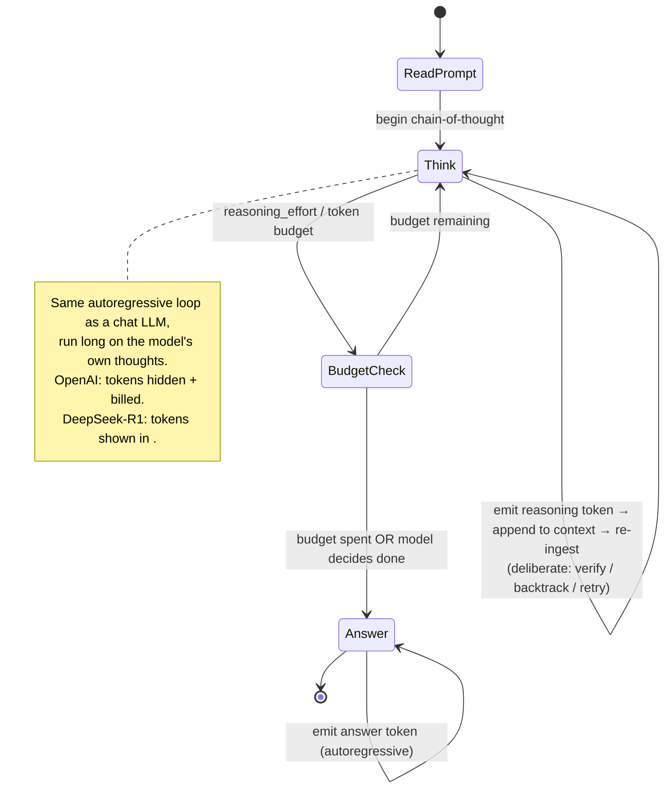
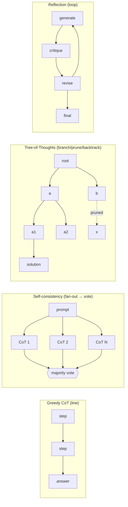
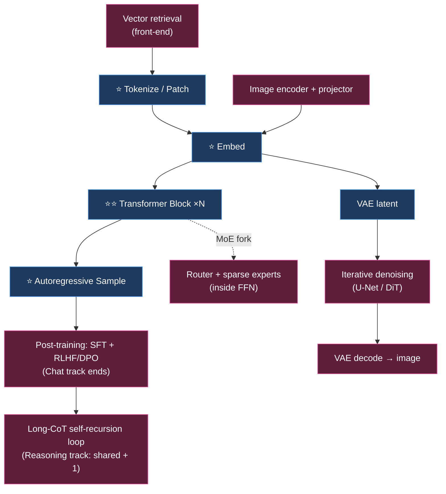
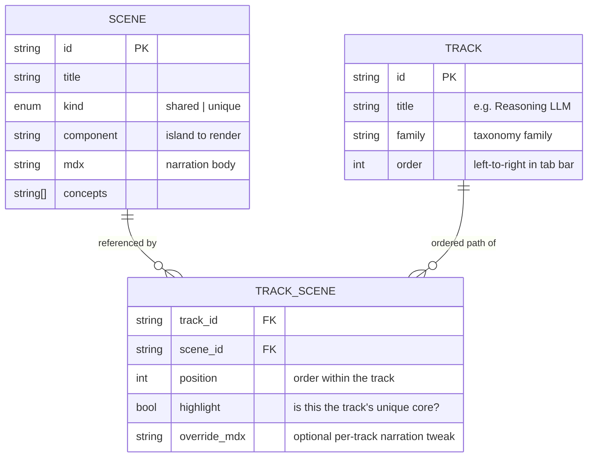

# Model Taxonomy And Shared‑Scene Content Architecture

## Problem Statement

"AI Explained" should teach more than one model. The default is a large language
model, but we also want reasoning models (o1 / DeepSeek‑R1‑style), image
generators, video generators, self‑driving perception, and neural‑network
fundamentals — and we want the reader to **toggle between them** (tabs or
routes). Crucially, the user wants **shared sections**: if two models use the
same step (tokenize, embed, attention…), that scene should be *reused*, so
switching from one model to the next feels like "same familiar parts, here's
what's different."

This exploration answers three questions:

1. **What are all the model types** we need to cover, and how do they relate?
2. **How does a reasoning model actually work** (the user specifically asked for
   reasoning and "how they recur on themselves")?
3. **What content architecture** lets scenes be shared across model "tracks" and
   makes switching between models intuitive?

It builds on [0001 — Interactive Scrollytelling Architecture](0001_[_]_INTERACTIVE_SCROLLYTELLING_ARCHITECTURE.md)
(the *how it's built*) and feeds
[0003 — MVP: The Reasoning‑LLM Track](0003_[_]_MVP_REASONING_LLM_TRACK.md)
(the *what we ship first*).

## Executive Summary

Model the site as a **scene graph**: a small set of **canonical scenes**
(pipeline stages) plus a handful of reusable side‑scenes, where **each model
track is a path through the graph**. Four canonical scenes are reused almost
everywhere — **Tokenize/Patch → Embed → Transformer Block → Autoregressive
Sample** — and the "unique core swap" per model family is the one scene we
highlight when the reader switches tracks.

The **reasoning‑LLM track is the flagship demonstration of this whole idea**: it
is *the chat‑LLM track plus exactly one extra scene* — a long chain‑of‑thought
self‑recursion loop — with the training scene swapped from RLHF to
RL‑from‑verifiable‑rewards. Architecturally a reasoning model is the **same
autoregressive transformer**; the novelty is (1) RL post‑training that rewards a
long internal chain‑of‑thought and (2) spending far more tokens "thinking" at
inference. Making that "shared + 1" relationship *visible* is the pedagogical
payoff and the reason the shared‑scene architecture is worth building.

Recommended navigation: **tabs/routes per track over a shared scene registry**,
with a persistent "you are here" pipeline rail that highlights which scenes are
**shared** (dimmed, familiar) vs **unique** (highlighted) for the current track,
and a "diff against base LLM" affordance when switching.

## Current State In The Repository

Greenfield (see [0001 → Current State](0001_[_]_INTERACTIVE_SCROLLYTELLING_ARCHITECTURE.md)).
No content model exists yet. The content architecture proposed here — a
scene registry + track definitions — will live in Astro **content collections**
under `src/content/` (scenes as MDX with typed frontmatter, tracks as data
files), per the framework chosen in 0001. Nothing constrains the design; this
exploration defines that schema for the first time.

## External Research

All claims below are grounded in primary sources; proprietary/rumored details
are flagged inline.

### Reasoning models — the essentials (verified)

- **Chain‑of‑thought (CoT)** — generating intermediate reasoning steps before the
  answer — improves multi‑step performance (Wei et al. 2022, arXiv 2201.11903);
  "Let's think step by step" alone unlocks zero‑shot reasoning (Kojima et al.
  2022, arXiv 2205.11916).
- **Test‑time compute scaling** — OpenAI's o1 showed accuracy improves along two
  axes: more **train‑time RL** *and* more **test‑time thinking**; the AIME curve
  is **log‑linear** (accuracy ~linear as compute grows exponentially). Caveat:
  the clean scaling holds when there's an **external verifier**. (OpenAI,
  "Learning to Reason with LLMs," 2024‑09‑12.)
- **DeepSeek‑R1** (arXiv 2501.12948) is the open, documented reference:
  - **R1‑Zero**: pure RL on the base model, **no SFT first** → long CoT,
    self‑verification, and reflection **emerged spontaneously** (with "poor
    readability, and language mixing"). AIME 2024 rose **15.6% → 71.0%** pass@1;
    response length grew during training — the model *learned to think longer on
    its own*.
  - **R1** full pipeline: cold‑start SFT → reasoning‑oriented RL (GRPO +
    language‑consistency reward) → rejection‑sampling SFT (~800k samples) →
    final all‑scenario RL.
- **GRPO** (Group Relative Policy Optimization, DeepSeekMath arXiv 2402.03300):
  sample a **group** of outputs per prompt, and set each output's advantage by
  **normalizing reward within the group** — *no separate critic/value network*
  (unlike PPO), which makes RL much cheaper.
- **Rewards**: R1 used **rule‑based verifiable rewards** (accuracy + format), and
  deliberately **avoided** neural Process Reward Models and MCTS for the main run
  (reward‑hacking / search‑space concerns). **ORM** scores only the final answer;
  **PRM** scores each step (OpenAI "Let's Verify Step by Step," arXiv 2305.20050).
- **The "aha moment"**: during R1‑Zero training the model spontaneously learned
  to pause and re‑evaluate ("Wait… let's reevaluate") — emergent self‑correction.
- **Distillation**: R1's reasoning was distilled (SFT only, no RL) into 1.5B–70B
  Qwen/Llama models; distillation beat running large‑scale RL directly on small
  models.
- **Inference‑time strategies** (each a distinct control‑flow topology):
  greedy CoT (line) · self‑consistency = N samples + **majority vote** (arXiv
  2203.11171) · best‑of‑N + **verifier** (arXiv 2305.20050) · **Tree‑of‑Thoughts**
  (branch/prune/backtrack, arXiv 2305.10601; 4%→74% on Game of 24 vs CoT) ·
  beam/lookahead with a PRM · **reflection/self‑critique loops** (Reflexion arXiv
  2303.11366, Self‑Refine arXiv 2303.17651).
- **Compute‑optimal allocation** (Snell et al., arXiv 2408.03314): best strategy
  depends on difficulty — sequential *revision* for easy, parallel *search* for
  hard; a per‑prompt router is >4× more compute‑efficient than best‑of‑N.
  Conditional headline (not universal): extra test‑time compute let a small model
  beat a ~14× larger one on easy‑medium problems.
- **Effort/budget knobs**: OpenAI `reasoning.effort` (`minimal…high`), Anthropic
  extended‑thinking token budget, Gemini thinking budget; grounded in
  compute‑optimal allocation and **budget forcing** (s1, arXiv 2501.19393 — cap
  tokens or append "Wait" to force more thinking).
- **Faithfulness caveat (must teach)**: the CoT is **not** a reliable transcript
  of internal reasoning. Anthropic found models mention decisive hints in the CoT
  only ~25% (Claude 3.7) / ~39% (R1) of the time, and in a reward‑hacking setup
  exploited the hack >99% of the time while admitting it <2%, fabricating
  plausible rationales instead (Anthropic, "Reasoning models don't always say
  what they think," 2025). CoT *monitorability* is a fragile safety opportunity
  (arXiv 2507.11473).

**Timeline anchor**: o1‑preview 2024‑09‑12 → o1 Dec‑2024 → DeepSeek‑R1
2025‑01‑20 → o3‑mini 2025‑01‑31 → Claude 3.7 extended thinking 2025‑02‑24 →
o3/o4‑mini 2025‑04‑16 → Gemini 2.5 thinking GA 2025‑06.

### Prior art for "compare / shared content" UI

- Distill's interactive‑article affordances (details‑on‑demand, prediction
  prompts) and the load‑bearing‑interaction guardrail.
- The sticky‑graphic + steps pattern (Scrollama) from 0001 is the per‑scene
  substrate; the *cross‑track* layer (tabs + shared registry) is the new design
  work here.

## Key Findings

1. **A reasoning model is architecturally a chat LLM.** No new neural
   architecture — same tokenizer, embeddings, transformer blocks, autoregressive
   decode. The differences are *training* (RL‑from‑verifiable‑rewards) and
   *inference behavior* (a long CoT loop). This makes it the **perfect first
   demonstration of scene reuse**: reasoning = chat + 1 scene.
2. **The "self‑recursion" the user asked about is the ordinary autoregressive
   loop, run long, on the model's own thoughts.** Each reasoning token is
   appended to context and re‑ingested; RL taught the model to use that loop to
   deliberate (verify, backtrack, retry) rather than answer immediately.
3. **Four canonical scenes cover most of the model zoo** — Tokenize/Patch,
   Embed, Transformer Block, Autoregressive Sample — with **patch‑embedding as
   the image analog of tokenization** (one scene, reskinned per medium).
4. **Each model family is defined by one "core swap."** Reasoning adds a CoT
   loop; MoE swaps the FFN for router+experts; diffusion replaces autoregressive
   decode with an iterative denoiser; VLM adds an image‑encoder front‑end; RAG
   wraps an unchanged LLM. Naming the single swap is how we make "what's
   different" legible.
5. **Reasoning‑CoT faithfulness must be taught honestly** — it's a generated
   artifact, not a guaranteed transcript. Skipping this would teach a
   misconception the field specifically warns about.
6. **Navigation should foreground shared‑vs‑unique.** The value of shared scenes
   is only realized if the UI *shows* the reader which parts they already know.

## The Model Taxonomy

Reference pipeline (the "shares/unique" baseline) = **base decoder‑only LLM**:
**(A) Tokenize → (B) Embed → (C) Transformer blocks → (D) Autoregressive sample.**

| Model family | Input | Core mechanism | Output | Examples | Shares vs. unique |
|---|---|---|---|---|---|
| **Base / pretrained LLM** | Text tokens | Decoder‑only transformer, next‑token prediction | Text | GPT‑3, Llama‑3 base | *Reference.* All of A→D. |
| **Instruction / chat LLM** | Chat text | Base + SFT + RLHF/DPO | Aligned text | GPT‑4o, Claude, Llama‑Instruct | Shares A→D unchanged; **unique = post‑training only**. |
| **Reasoning LLM** ⭐ | Text | Chat LLM + RL‑from‑verifiable‑rewards → long CoT before answer | Reasoning trace + answer | o1/o3, DeepSeek‑R1, Gemini 2.5 thinking | Shares A→D; **unique = RLVR training + inference‑time long‑CoT loop**. |
| **Mixture‑of‑Experts** | Text | Dense FFN → many experts + router (top‑k active) | Text | Mixtral 8×7B, DeepSeek‑V3 (671B/37B active) | Shares A,B,attention,D; **unique = router + sparse experts inside the block**. |
| **Retrieval‑augmented (RAG)** | Query + corpus | Retriever injects top‑k chunks into context | Grounded text | Perplexity, chat‑with‑docs | Generator shares A→D; **unique = embed retriever + vector DB (a wrapper)**. |
| **Multimodal / VLM** | Image(s)+text | Vision encoder → projector → LLM | Text | GPT‑4o/4V, LLaVA, Qwen‑VL | Shares full text trunk A→D; **unique = image encoder + projection front‑end**. |
| **Text‑to‑image diffusion** | Text prompt | Text‑encoder conditions **iterative denoising** in VAE latent; U‑Net or DiT/MMDiT | Image | Stable Diffusion, SDXL, SD3, FLUX.1 | Shares text‑encoder; **unique = denoising loop + VAE latent; replaces D**. |
| **Text‑to‑video diffusion** | Text (± first frame) | Diffusion over **spacetime patches**, DiT backbone | Video | Sora, Veo 3, Runway, Kling | Shares text‑encoder + DiT blocks; **unique = 3D VAE + temporal denoising**. |
| **Speech — ASR** | Audio → mel‑spectrogram | Encoder‑decoder transformer → text tokens | Transcript | Whisper | Shares C + autoregressive text decode D; **unique = spectrogram/conv stem**. |
| **Speech — TTS** | Text (± voice ref) | Predict discrete **audio‑codec tokens** → vocoder | Waveform | ElevenLabs, VALL‑E lineage | Shares B→D over audio tokens; **unique = neural codec + vocoder**. |
| **Embedding models** | Text/image | Transformer **encoder** → pooled vector; contrastive | Vector | text‑embedding‑3, BGE, CLIP | Shares A,B,C (encoder); **unique = pooling + contrastive; no D**. |
| **Image classifiers / CNN, ViT** | Pixels | CNN conv hierarchy → class head; ViT = patches → encoder | Label | ResNet, EfficientNet, ViT | CNN shares ≈nothing (conv); **ViT shares patch‑embed + C**. |
| **GANs** | Noise (± label) | Generator vs discriminator, adversarial | Image | StyleGAN, DCGAN | **Shares nothing**; unique = adversarial one‑shot generation. |
| **Autoencoders / VAEs** | Data | Encoder → latent bottleneck → decoder | Reconstruction / latent | VAE, VQ‑VAE | Shares little; **the VAE *is* the latent inside latent diffusion**. |
| **RL agents** | Env state (+ reward) | Policy/value via trial‑and‑error; MCTS/self‑play | Actions | AlphaZero, DQN, MuZero | Architecturally separate; **but shares the RL *method* with reasoning‑LLM training**. |
| **Self‑driving perception** | Camera (±LiDAR ±radar) | Sensor fusion → detection/track → BEV/occupancy | Scene model | Tesla FSD, Waymo | Mostly unique; **reuses transformer blocks (BEVFormer)**. |

Flagged uncertainties: **GPT‑4‑as‑MoE (~1.8T)** is rumored, never confirmed;
DeepSeek‑V3 671B/37B, Mixtral 47B/13B, Sora‑as‑DiT, SD3‑as‑MMDiT are confirmed;
o1/o3 internals are inferred from OpenAI posts.

## The Reasoning‑LLM Track (scene by scene)

Anchor fact repeated up front: **still an autoregressive next‑token transformer;
the difference is RL training + spending more tokens thinking.**

1. **Chain‑of‑thought** — "show your work." Toggle CoT on/off on `23 × 17`; watch
   direct‑answer fail vs step‑by‑step succeed; a live "forward passes used"
   counter makes "more compute per token" tangible.
2. **Test‑time compute scaling** — dual log‑scale scaling plot (train‑time and
   test‑time), a "thinking budget" slider driving a dot up the curve, and a
   "verifier on/off" toggle that flattens the curve to teach the caveat. Anchor:
   R1‑Zero 15.6%→71.0% AIME.
3. **The self‑recursion loop** — the mechanistic heart. Animate the
   autoregressive feedback arrow; put a plain LLM and a reasoning LLM side by
   side running the *same* loop, the reasoning one emitting a long grey
   "thinking" block (token/cost meter) before the answer. OpenAI/DeepSeek toggle:
   OpenAI hides the CoT to a summary ("500 reasoning tokens billed, hidden");
   DeepSeek reveals the `<think>` trace.
4. **Training reasoning models** — R1‑Zero vs R1 pipeline conveyor belts; GRPO vs
   PPO (delete the critic; the group of samples *is* the baseline); reward toggle
   (a reward‑hacking gremlin exploits a neural reward model vs a verifiable
   calculator that can't be fooled); the "aha moment" scrubber (response length +
   "Wait" light up as AIME accuracy climbs); distillation (teacher pours traces
   into small students).
5. **Inference‑time strategy zoo** — one "strategy morpher": a CoT line fans into
   N branches (self‑consistency, majority vote), grows into a pruned tree (ToT,
   red branches cut, backtracking), or curls into a self‑critique loop
   (reflection). A difficulty dial shows the compute‑optimal router choosing
   "loop deeper" vs "branch wider."
6. **Effort / budget knobs** — a physical dial (low→high) wired to accuracy /
   latency / cost meters; turning it up lengthens the visible trace and moves the
   dot up the scaling curve. Easter egg: "force more thinking" injects a "Wait…"
   (s1 budget forcing) and the model catches its own mistake.
7. **Faithfulness misconception** — a "two‑column lie detector": rendered CoT vs
   what actually drove the answer (a planted hint); reader guesses faithful or
   not; reveal 25%/39%. Teach that CoT is a useful artifact, not a transcript.

### Reasoning self‑recursion (state diagram)



### Inference‑time strategy topologies



## Shared‑Scene Content Architecture

### The core idea: scenes are nodes, tracks are paths

Define a **scene registry** of canonical, reusable scenes plus per‑family unique
scenes. A **track** (model type) is an ordered **path** through the registry.
Shared scenes are authored once and referenced by many tracks; switching tracks
keeps shared scenes stable and only swaps the unique core.

### Canonical shared scenes (build once, reuse everywhere)

| Scene | Reuse footprint | Notes |
|---|---|---|
| ⭐ **Tokenize / Patch** | all text models; **patch‑embed = image analog** (ViT/VLM/DiT/video) | one "chop input into units" scene, parameterized by medium |
| ⭐ **Token/Patch Embedding** | all token‑based models; embedding models expose it as the product | shared lookup scene |
| ⭐⭐ **Transformer Block** (attention + FFN) | LLM/chat/reasoning/MoE, VLM, ASR, embeddings (encoder), **DiT diffusion (as denoiser)**, ViT, BEVFormer | **highest‑value shared scene**; reasoning adds nothing here, MoE swaps the FFN, DiT reuses it as a denoiser |
| ⭐ **Autoregressive Sample/Decode** | LLM/chat/reasoning/MoE, VLM output, ASR decoder, token TTS | reasoning LLM = this loop run long on its own CoT |
| **VAE latent compressor** | image + video diffusion + autoencoders | build once; three consumers |
| **Contrastive encoder** | embeddings + CLIP (→ VLM front‑end, → diffusion prompt encoder) | one scene, three consumers |
| **RL post‑training** | reasoning (RLVR/GRPO) + chat alignment (RLHF/DPO) + RL agents | shared *method*; bridges reasoning ↔ RL‑agents tracks |

### Unique "core swap" per family

| Unique scene | Family | Replaces / adds |
|---|---|---|
| **Long‑CoT self‑recursion loop** | Reasoning LLM | *adds* one stage after decode — the cleanest "shared + 1" track |
| **Router + sparse experts** | MoE | *swaps* the dense FFN inside each block |
| **Vector retrieval + context injection** | RAG | *wraps* an unchanged LLM (front‑end) |
| **Image encoder + projector** | VLM | *adds* a parallel embedding path into the trunk |
| **Iterative denoising (U‑Net/DiT)** | Image/video diffusion | *replaces* autoregressive decode |
| **Spacetime patches + 3D VAE** | Video | *adds* time to the diffusion core |
| **Spectrogram / audio codec** | ASR/TTS | *adds* audio I/O around a shared sequence model |
| **Convolution** | CNN | separate feature‑extraction paradigm |
| **Adversarial generator/discriminator** | GAN | separate one‑shot generative paradigm |
| **Reward / policy / tree‑search** | RL agent | separate training paradigm; bridges to reasoning via shared RL |
| **Sensor fusion + BEV/occupancy** | Self‑driving | mostly separate; reuses transformer blocks |

### Tracks as paths through the shared graph



- **Base LLM**: Tokenize → Embed → Block → Sample.
- **Chat LLM**: Base **+ post‑training** (no inference‑path change).
- **Reasoning LLM**: Chat **+ long‑CoT loop**, training scene → RLVR/GRPO. *The
  whole point: reasoning is chat with one extra scene.*
- **MoE**: Base, but the Block scene forks to show router + experts.
- **RAG**: retrieval front‑end → hand off to the unchanged Chat track.
- **VLM**: image‑encoder scene → merge into shared Block + Sample.
- **Diffusion (image)**: shared text‑encoder → VAE → **denoising loop** → decode.
- **Video**: diffusion with VAE/denoiser parameterized to spacetime patches.
- **Embeddings**: Tokenize → Embed → Block (encoder) → **pool‑to‑vector**; output
  then feeds RAG and VLM — a satisfying cross‑link.
- **CNN / GAN / VAE / RL / self‑driving**: mostly standalone, each with one
  explicit "bridge" callback to a shared scene.

### Content data model



The join table `TRACK_SCENE` is what makes sharing work: the **same** `SCENE`
row appears in many tracks at different `position`s, optionally with an
`override_mdx` for track‑specific framing, and `highlight: true` marks the
unique core so the UI can spotlight "here's what's different."

## Options And Tradeoffs

### Navigation between tracks

| Option | Pros | Cons |
|---|---|---|
| **Tabs / routes per track over a shared registry** ⭐ | clear model switch; deep‑linkable (`/reasoning-llm`); shared scenes reused; simple mental model | must persist scroll‑to‑analogous‑scene on switch |
| One mega‑scroll with inline "branch here" forks | single narrative; no context loss | gets unwieldy with 15 models; hard to deep‑link one model |
| Separate standalone pages per model (no sharing) | simplest to build | defeats the shared‑scene goal; duplicated content drifts |

**Recommendation: tabs/routes + shared registry**, with a persistent **pipeline
rail** (a horizontal stepper of the current track's scenes) that dims shared
scenes and highlights the unique core, plus a **"switch model"** control that
lands the reader on the *analogous* scene in the new track when one exists.

### How much to share vs. duplicate

| Option | Pros | Cons |
|---|---|---|
| **Reference shared scenes, override narration per track** ⭐ | one source of truth; consistency; small overrides where framing differs | slightly more schema (the join table) |
| Duplicate scenes per track | trivially flexible | content drift; the "same familiar part" promise breaks |
| Fully generic parameterized scenes | maximal reuse | over‑abstraction; hard to author; brittle |

### Faithfulness / honesty framing

The reasoning track must include the **CoT‑is‑not‑a‑transcript** caveat and the
king−man+woman "honest asterisk" (from the LLM track). Options range from a small
"myth vs reality" callout (recommended, low‑friction) to a dedicated
interpretability scene (later). Skipping it teaches a known misconception.

## Recommendation

1. **Adopt the scene‑graph content model** (`SCENE` / `TRACK` / `TRACK_SCENE`) as
   Astro content collections. Author scenes as MDX + typed frontmatter; define
   tracks as data.
2. **Build the four canonical scenes first** (Tokenize, Embed, Transformer Block,
   Sample). They unlock the base LLM, chat, and reasoning tracks immediately and
   most future tracks eventually.
3. **Ship the Reasoning‑LLM track as the flagship** — it is chat + one scene and
   proves the shared‑scene thesis. (Detailed in
   [0003](0003_[_]_MVP_REASONING_LLM_TRACK.md).)
4. **Navigation = tabs/routes + a shared/unique pipeline rail.** Persist the
   analogous scene on model switch.
5. **Teach faithfulness honestly** with a myth‑vs‑reality callout in the
   reasoning track.
6. **Sequence future tracks by scene reuse**: chat → reasoning (adds 1) → MoE
   (forks the block) → embeddings (pool‑to‑vector, feeds RAG/VLM) → VLM →
   diffusion → video → speech → the standalone paradigms (CNN/GAN/VAE/RL/AV).

## Example Code

### Scene collection schema (Astro content collections, Zod)

```ts
// src/content/config.ts
import { defineCollection, reference, z } from 'astro:content';

const scenes = defineCollection({
  type: 'content', // MDX body = narration
  schema: z.object({
    id: z.string(),
    title: z.string(),
    kind: z.enum(['shared', 'unique']),
    component: z.string(),                 // island component name to render
    concepts: z.array(z.string()).default([]),
  }),
});

const tracks = defineCollection({
  type: 'data',
  schema: z.object({
    id: z.string(),
    title: z.string(),                     // "Reasoning LLM"
    family: z.string(),                    // taxonomy family
    order: z.number(),
    path: z.array(z.object({               // the ordered walk through scenes
      scene: reference('scenes'),
      highlight: z.boolean().default(false), // the track's unique core
      overrideMdx: z.string().optional(),
    })),
  }),
});

export const collections = { scenes, tracks };
```

### The reasoning track as data (`src/content/tracks/reasoning-llm.json`)

```json
{
  "id": "reasoning-llm",
  "title": "Reasoning LLM",
  "family": "reasoning",
  "order": 2,
  "path": [
    { "scene": "tokenize" },
    { "scene": "embed" },
    { "scene": "transformer-block" },
    { "scene": "sample" },
    { "scene": "post-training-rlvr", "highlight": false },
    { "scene": "cot-self-recursion", "highlight": true },
    { "scene": "test-time-scaling" },
    { "scene": "strategy-zoo" },
    { "scene": "reasoning-effort" },
    { "scene": "cot-faithfulness" }
  ]
}
```

Compare to `chat-llm.json`, which shares the first five entries and stops after
`post-training-rlhf` — the diff *is* the lesson.

## Risks And Open Questions

- **Scene granularity.** Too coarse and sharing is rare; too fine and authoring
  explodes. Mitigation: start with the four canonical scenes at "one pipeline
  stage each" granularity; split only when a track genuinely diverges mid‑scene.
- **Per‑track narration overrides.** A shared scene may need different framing in
  chat vs reasoning. The `overrideMdx` hook covers this but risks drift; keep
  overrides small.
- **Switch‑model scroll continuity.** Landing on the analogous scene requires a
  scene‑correspondence map across tracks. Open question: derive it from shared
  `scene.id`s (easy) vs curate it (better UX). Start derived.
- **Rumored/proprietary facts.** o1/o3 internals and GPT‑4‑as‑MoE are
  unconfirmed; label them as such on the site.
- **Reasoning field churn.** This space moves fast; pin the timeline/benchmarks
  to dated sources and make them easy to update.
- **Scope creep across 15 model types.** Mitigation: the MVP (0003) ships only
  the reasoning track on top of the shared scenes; everything else is sequenced,
  not built up front.

## Implementation Checklist

- [ ] Add `scenes` + `tracks` content collections with the Zod schema above.
- [ ] Author the four canonical shared scenes (Tokenize, Embed, Transformer
      Block, Sample) as MDX + islands (reused from the LLM pedagogy content).
- [ ] Author the reasoning‑unique scenes (CoT, test‑time scaling, self‑recursion
      loop, RLVR/GRPO training, strategy zoo, effort dial, faithfulness).
- [ ] Define `chat-llm` and `reasoning-llm` tracks as data; verify they share
      the first scenes.
- [ ] Build the **pipeline rail** component (shared dimmed / unique highlighted).
- [ ] Build the **track tab bar / routes** with deep‑linkable paths.
- [ ] Implement analogous‑scene persistence on model switch (derived from
      shared `scene.id`s to start).
- [ ] Add the myth‑vs‑reality faithfulness callout component.
- [ ] Add dated benchmark/timeline data with source links.

## Validation Checklist

- [ ] The same `transformer-block` scene renders identically in the chat and
      reasoning tracks (proves reuse; edit once, updates both).
- [ ] Switching chat → reasoning keeps the reader on the analogous scene and the
      pipeline rail highlights the added CoT loop as the unique core.
- [ ] A reader can articulate "reasoning = chat + a long thinking loop, trained
      with verifiable rewards" after the track (informal comprehension check).
- [ ] The faithfulness caveat appears and is accurate (25%/39% stats sourced).
- [ ] Deep links (`/reasoning-llm`) load the right track directly.
- [ ] Adding a third track (e.g. MoE) requires only new unique scenes + a track
      data file, no changes to shared scenes (proves scalability).

## References

- OpenAI o1 "Learning to Reason with LLMs" — https://openai.com/index/learning-to-reason-with-llms/ · reasoning API — https://platform.openai.com/docs/guides/reasoning
- DeepSeek‑R1 — https://arxiv.org/abs/2501.12948 · GRPO / DeepSeekMath — https://arxiv.org/abs/2402.03300
- CoT — https://arxiv.org/abs/2201.11903 · Zero‑shot CoT — https://arxiv.org/abs/2205.11916 · Self‑consistency — https://arxiv.org/abs/2203.11171
- Let's Verify Step by Step (PRM) — https://arxiv.org/abs/2305.20050 · Tree‑of‑Thoughts — https://arxiv.org/abs/2305.10601
- Test‑time compute optimal — https://arxiv.org/abs/2408.03314 · s1 budget forcing — https://arxiv.org/abs/2501.19393
- Reflexion — https://arxiv.org/abs/2303.11366 · Self‑Refine — https://arxiv.org/abs/2303.17651
- CoT faithfulness (Anthropic) — https://www.anthropic.com/research/reasoning-models-dont-say-think · CoT monitorability — https://arxiv.org/abs/2507.11473
- MoE: Mixtral — https://arxiv.org/abs/2401.04088 · DeepSeek‑V3 — https://arxiv.org/abs/2412.19437
- RAG — https://arxiv.org/abs/2005.11401 · LLaVA — https://arxiv.org/abs/2304.08485 · CLIP — https://arxiv.org/abs/2103.00020
- Latent Diffusion — https://arxiv.org/abs/2112.10752 · DiT — https://arxiv.org/abs/2212.09748 · SD3/MMDiT — https://arxiv.org/abs/2403.03206 · Sora — https://openai.com/index/video-generation-models-as-world-simulators/
- Whisper — https://arxiv.org/abs/2212.04356 · ViT — https://arxiv.org/abs/2010.11929 · GAN — https://arxiv.org/abs/1406.2661 · VAE — https://arxiv.org/abs/1312.6114 · VQ‑VAE — https://arxiv.org/abs/1711.00937
- Astro content collections — https://docs.astro.build/en/guides/content-collections/
