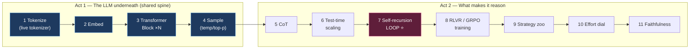
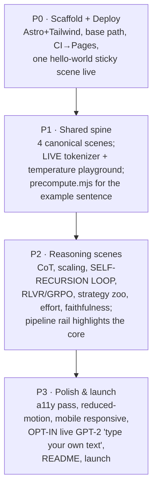
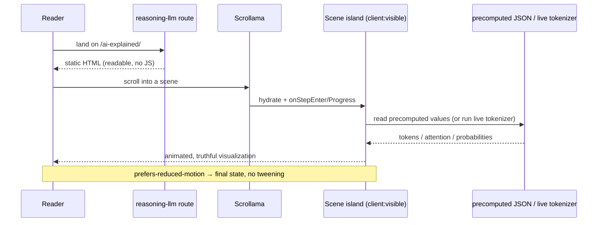

# MVP: The Reasoning‑LLM Track (v1 that scales to the full model zoo)

## Problem Statement

We have two explorations on the shelf:

- [0001 — Interactive Scrollytelling Architecture](0001_[_]_INTERACTIVE_SCROLLYTELLING_ARCHITECTURE.md)
  (the *how it's built*: Astro islands + Scrollama + tiered rendering + Pages).
- [0002 — Model Taxonomy And Shared‑Scene Architecture](0002_[_]_MODEL_TAXONOMY_AND_SHARED_SCENE_ARCHITECTURE.md)
  (the *what & how it's organized*: a scene graph where tracks are paths, and
  reasoning = chat + one scene).

This exploration synthesizes them into a **concrete MVP**: the very first version
we can put live on GitHub Pages. The MVP's teaching goal is **how a reasoning LLM
works** — but it must be built so that adding the next model type (MoE,
diffusion, VLM…) is *additive*, not a rewrite. In other words: ship one track
well, on top of the shared‑scene foundation, so tracks 2..N are cheap.

## Executive Summary

**Ship a single scrollable page/route — the Reasoning‑LLM track — built on the
shared scene registry, deployed to GitHub Pages via Astro.** The track walks the
reader from raw text to a reasoning model's final answer using **~11 scenes**:
the four canonical shared scenes (Tokenize → Embed → Transformer Block → Sample)
plus the reasoning‑specific scenes (CoT, test‑time scaling, the self‑recursion
loop, RLVR/GRPO training, the strategy zoo, the effort dial, and a faithfulness
caveat).

Because reasoning is literally "chat LLM + one loop," building this track forces
us to build the **entire reusable spine** — tokenizer, embeddings, attention,
sampling — that every future track needs. The MVP therefore delivers a great
standalone lesson *and* ~70% of the infrastructure for model #2, at MVP cost.

Two deliberate MVP scoping calls: (1) **the base LLM pipeline is included** (you
can't explain reasoning without it) but presented as "Part 1: the LLM
underneath," and (2) the **track‑switcher UI is stubbed but real** — we ship the
scene registry, the pipeline rail, and one active track, with the tab bar present
and showing "more models coming," so track #2 slots in without refactoring.

Phase it: **P0** scaffold + deploy a hello‑world scene → **P1** the four shared
scenes with the two flagship interactives (live tokenizer, temperature
playground) → **P2** the reasoning‑specific scenes and the self‑recursion loop →
**P3** polish, a11y, live GPT‑2 opt‑in demo, launch.

## Current State In The Repository

Greenfield. Only `.claude/` and `docs/explorations/` (this series) exist; git was
initialized on `main` during exploration 0001. **No `package.json`, framework,
source, or CI yet.** The MVP therefore starts with `npm create astro@latest`.
The three exploration docs are the spec; nothing to refactor, everything to
build. The first code commit will scaffold the Astro project per 0001's stack
recommendation.

## External Research

This exploration is a *synthesis* — the primary research lives in 0001
(architecture, prior art, client‑side inference feasibility) and 0002 (reasoning
models, taxonomy, scene graph). The MVP‑relevant highlights:

- **Transformer Explainer** (https://poloclub.github.io/transformer-explainer/)
  proves the exact MVP shape is feasible on GitHub Pages: a live small model,
  type‑your‑own‑text, temperature slider, expand‑on‑click — all static‑hosted.
  It is the closest existing template and our north star for the shared scenes.
- **Client‑side feasibility** (0001): instant tokenization via `gpt-tokenizer`
  (no weights); GPT‑2 small (124M) via `transformers.js`, lazy‑loaded, is the
  flagship live demo; both work on static hosting.
- **The four flagship interactives** the LLM‑pedagogy research identified as
  carrying the most teaching weight — **(1) live tokenizer, (2) embedding /
  nearest‑neighbors, (3) attention heatmap with causal mask, (4) temperature /
  top‑p probability playground** — map directly onto the four shared scenes and
  are the MVP's interactive backbone.
- **Reasoning anchor facts** (0002): a reasoning model is the same autoregressive
  transformer + RL training + a long thinking loop; R1‑Zero 15.6%→71.0% AIME;
  CoT is not a faithful transcript (25%/39%).

## Key Findings

1. **Building the reasoning track = building the reusable spine.** The four
   shared scenes are prerequisites, so the MVP inherently produces the
   foundation for every later track. This is why "reasoning first" is the
   *strategically* right MVP, not just a topical one.
2. **The MVP must include the base‑LLM pipeline**, framed as "the LLM underneath"
   — reasoning is incomprehensible without tokenization/attention/sampling first.
   This is a feature, not scope creep: it's the shared spine.
3. **Two flagship interactives are enough for a compelling v1**: the **live
   tokenizer** (instant, no weights) and the **temperature/top‑p probability
   playground** (works on precomputed or live logits). The others can be
   precomputed for the MVP and upgraded to live later.
4. **The self‑recursion loop scene is the emotional/pedagogical climax** of the
   reasoning track and the one genuinely reasoning‑specific interactive that must
   be built for the MVP.
5. **Ship the track‑switcher as a real‑but‑stubbed shell.** The scene registry +
   pipeline rail + tab bar should exist in v1 (with one active track) so track #2
   is additive. Skipping this now would force a refactor later.
6. **Live GPT‑2 is a P3 opt‑in enhancement, not a P1 blocker.** Precomputed
   values for a fixed example sentence get us truthful visuals with zero download;
   the live "type your own text" upgrade lands behind a button once the spine is
   solid.

## Scope: In / Out for the MVP

| In (v1) | Out (later tracks / phases) |
|---|---|
| One route: `/reasoning-llm` (default landing) | MoE, RAG, VLM, diffusion, video, speech, embeddings‑as‑product, CNN, GAN, VAE, RL, self‑driving tracks |
| The 4 shared scenes (Tokenize, Embed, Transformer Block, Sample) | Deep Bycroft‑style 3D "every multiply" visualization |
| Reasoning scenes (CoT, scaling, self‑recursion loop, RLVR/GRPO, strategy zoo, effort dial, faithfulness) | Interpretability / feature‑browser scenes |
| Flagship interactives: live tokenizer + temperature/top‑p playground | Live "type your own text" through full GPT‑2 (P3 opt‑in) |
| Precomputed embeddings/attention for one fixed example sentence | Live embedding nearest‑neighbor search at scale |
| Scene registry + pipeline rail + tab bar shell (1 active track) | Full multi‑track switching with analogous‑scene persistence |
| `prefers-reduced-motion` + keyboard a11y + static fallback | Mobile‑bespoke simplified visuals (basic responsive only in v1) |
| GitHub Actions → Pages deploy, MIT license, README | Custom domain |

## The MVP Scene List (the `/reasoning-llm` track)

Framed in two acts so the shared spine reads as "the LLM underneath" and the
reasoning scenes as "what makes it *reason*."

**Act 1 — The LLM underneath (shared spine; reused by every future track)**

| # | Scene | Shared? | MVP interactive | Renderer (per 0001) |
|---|---|---|---|---|
| 1 | **Tokenize** | ⭐ shared | **Live tokenizer** — type text → colored token boxes + IDs + count (instant, `gpt-tokenizer`) | SVG/DOM |
| 2 | **Embed** | ⭐ shared | Token → 768‑value vector strip; 2D projection of ~200 words, hover → nearest neighbors (precomputed) | SVG/Canvas |
| 3 | **Transformer Block** | ⭐⭐ shared | Attention heatmap w/ causal mask for the fixed example; hover a cell → token pair + weight (precomputed) | Canvas (+SVG overlay) |
| 4 | **Sample** | ⭐ shared | **Temperature + top‑p playground** — probability bars flatten/sharpen; "Sample!" rolls the die | SVG/D3 |

**Act 2 — What makes it reason (reasoning‑unique)**

| # | Scene | Highlight | MVP interactive | Renderer |
|---|---|---|---|---|
| 5 | **CoT: show your work** | | Toggle "think step by step" on `23×17`; forward‑pass counter | DOM/SVG |
| 6 | **Test‑time compute scaling** | | Dual log‑scale curve; "thinking budget" slider; verifier on/off | SVG/D3 |
| 7 | **The self‑recursion loop** ⭐ | **unique core** | Plain LLM vs reasoning LLM side‑by‑side on the same loop; grey thinking block + token/cost meter; OpenAI(hidden)/DeepSeek(`<think>`) toggle | SVG/DOM anim |
| 8 | **Training reasoning models** | | R1‑Zero vs R1 belts; GRPO deletes the critic; reward‑hacking gremlin vs verifier; "aha moment" scrubber | SVG |
| 9 | **Strategy zoo** | | "Strategy morpher": line → fan‑out (vote) → pruned tree (ToT) → self‑critique loop; difficulty dial | SVG/D3 |
| 10 | **Reasoning effort / budget** | | Dial low→high wired to accuracy/latency/cost meters; s1 "force more thinking" easter egg | SVG |
| 11 | **Faithfulness caveat** | | Two‑column "lie detector"; reveal 25%/39% stats | DOM/SVG |

The **"shared + 1"** teaching moment: the pipeline rail shows scenes 1–4 as the
familiar spine (also present in the future Chat track), and scene 7 highlighted
as the *one* thing reasoning adds.



## Options And Tradeoffs

### How much to build for v1

| Option | Pros | Cons | Verdict |
|---|---|---|---|
| **A. Full reasoning track, precomputed visuals + 2 live interactives** ⭐ | complete, honest lesson; builds the whole shared spine; fast to load; low risk | more scenes to author than a teaser | **Recommended** |
| B. Teaser: 3–4 scenes only | fastest to ship | doesn't actually explain reasoning; throws away the spine investment | reject |
| C. Full track with everything live (GPT‑2 everywhere) | maximally impressive | heavy downloads, WebGPU variance, slow, risky for v1 | defer live to P3 |

### Live vs precomputed model values (MVP)

| Option | Pros | Cons |
|---|---|---|
| **Precomputed values for one fixed example + live tokenizer/sampling** ⭐ | truthful visuals, zero model download, deterministic, works on any device | can't type arbitrary text through the full model yet |
| Live GPT‑2 for everything from day one | type‑your‑own‑text everywhere | tens–hundreds of MB, slow first load, mobile issues |

Precompute attention/embeddings for the example sentence at **build time**
(a small Node script using `transformers.js` writes JSON into `src/data/`), so
the site ships truthful numbers with no runtime model. The tokenizer and the
temperature/top‑p sampling are cheap and run live. **Live full‑model "type your
own text" is a P3 opt‑in** behind a button.

### Track‑switcher: build now or later

| Option | Pros | Cons |
|---|---|---|
| **Real registry + rail + stubbed tab bar now** ⭐ | track #2 is additive; proves the architecture; no refactor | slightly more upfront structure |
| Hardcode a single page now, add switching later | fastest v1 | guarantees a refactor; risks baking in non‑shareable assumptions |

### UI framework for islands

React (familiar, matches `transformers.js`/Motion examples) vs Svelte (lighter,
what Transformer Explainer uses). **Recommendation: React for the MVP** for
ecosystem familiarity and speed; Astro keeps Svelte available for a
performance‑critical island later without a rewrite.

## Recommendation

Build **Option A** — the full Reasoning‑LLM track with precomputed visuals plus
the two live flagship interactives — on the **real scene registry + pipeline rail
+ stubbed tab bar**, in four phases. This delivers a genuinely good standalone
lesson on reasoning models while constructing the reusable spine and the
multi‑track shell, so model #2 is additive.

### Proposed repository structure

```text
ai-explained/
├─ astro.config.mjs            # site + base:'/ai-explained', mdx, react, tailwind
├─ package.json
├─ tailwind.config / @theme    # color grammar: weights vs activations vs data
├─ .github/workflows/deploy.yml
├─ scripts/
│  └─ precompute.mjs           # build-time: transformers.js → src/data/*.json
├─ src/
│  ├─ content/
│  │  ├─ config.ts             # scenes + tracks collections (Zod, from 0002)
│  │  ├─ scenes/*.mdx          # narration per scene (shared + reasoning)
│  │  └─ tracks/reasoning-llm.json
│  ├─ components/
│  │  ├─ SceneScaffold.astro   # sticky graphic + Scrollama steps (from 0001)
│  │  ├─ PipelineRail.tsx      # shared-dimmed / unique-highlighted stepper
│  │  ├─ TrackTabs.astro       # tab bar (1 active + "more coming")
│  │  └─ islands/              # the interactive visuals (client:visible)
│  │     ├─ Tokenizer.tsx
│  │     ├─ EmbeddingSpace.tsx
│  │     ├─ AttentionHeatmap.tsx
│  │     ├─ SamplingPlayground.tsx
│  │     ├─ SelfRecursionLoop.tsx
│  │     └─ StrategyMorpher.tsx
│  ├─ data/                    # precomputed JSON (attention, embeddings)
│  ├─ lib/                     # reduced-motion guard, scroll utils, interpolation
│  └─ pages/
│     ├─ index.astro           # redirects/renders the reasoning-llm track
│     └─ [track].astro         # renders any track from the registry
├─ LICENSE (MIT)
└─ README.md
```

### Phased delivery





## Example Code

### Build‑time precompute (truthful visuals, zero runtime model)

```js
// scripts/precompute.mjs — run in CI before astro build
import { pipeline, env } from '@huggingface/transformers';
import { writeFileSync } from 'node:fs';

env.allowRemoteModels = true;
const EXAMPLE = 'The capital of France is';

const extractor = await pipeline('feature-extraction', 'Xenova/gpt2', {
  // attention/hidden states extracted for the fixed example sentence
});
const out = await extractor(EXAMPLE, { output_attentions: true });

writeFileSync('src/data/example.json', JSON.stringify({
  text: EXAMPLE,
  // tokens, per-layer attention matrices, top next-token probabilities …
  // (shape-trimmed to what the islands render)
}, null, 2));
console.log('wrote src/data/example.json');
```

### Rendering a track from the registry (`src/pages/[track].astro`)

```astro
---
import { getCollection, getEntry } from 'astro:content';
import SceneScaffold from '../components/SceneScaffold.astro';
import PipelineRail from '../components/PipelineRail.tsx';

export async function getStaticPaths() {
  const tracks = await getCollection('tracks');
  return tracks.map((t) => ({ params: { track: t.data.id }, props: { track: t } }));
}
const { track } = Astro.props;
const scenes = await Promise.all(
  track.data.path.map(async (p) => ({ ...p, entry: await getEntry(p.scene) }))
);
---
<PipelineRail client:load scenes={scenes.map(s => ({
  id: s.entry.data.id, title: s.entry.data.title,
  kind: s.entry.data.kind, highlight: s.highlight,
}))} />
{scenes.map((s) => (
  <SceneScaffold sceneId={s.entry.data.id} component={s.entry.data.component}>
    <s.entry.Content />   <!-- MDX narration -->
  </SceneScaffold>
))}
```

### The live tokenizer island (instant, no weights)

```tsx
// src/components/islands/Tokenizer.tsx
import { useState } from 'react';
import { encode, decode } from 'gpt-tokenizer'; // o200k/cl100k available too

export default function Tokenizer() {
  const [text, setText] = useState('strawberry');
  const ids = encode(text);
  const tokens = ids.map((id) => decode([id]));
  return (
    <div>
      <input value={text} onChange={(e) => setText(e.target.value)} />
      <div className="flex flex-wrap gap-1">
        {tokens.map((t, i) => (
          <span key={i} className="token-chip" title={`id ${ids[i]}`}>{t}</span>
        ))}
      </div>
      <p>{ids.length} tokens</p>
    </div>
  );
}
```

## Risks And Open Questions

- **Authoring load of 11 scenes.** Mitigation: precompute visuals, reuse the LLM
  pedagogy content (already drafted in research), and phase P1→P2 so each scene
  ships when ready.
- **Scene granularity locking in too early.** Mitigation: keep the four canonical
  scenes at "one pipeline stage each"; validate reuse by defining a (not‑yet‑
  shipped) `chat-llm` track and confirming it shares scenes 1–4.
- **Precompute drift vs the live tokenizer.** The tokenizer is live; attention is
  precomputed from GPT‑2. Ensure the example sentence's tokens match between the
  live tokenizer and the precomputed JSON (use the same encoding).
- **Self‑recursion loop is the hardest island.** It's the climax and the most
  novel animation. Mitigation: prototype it early in P2; fall back to a
  simpler stepped animation if the live meter proves fiddly.
- **Reasoning facts churn / proprietary unknowns.** Label o1/o3 internals as
  inferred; pin benchmarks/timeline to dated sources; keep them in editable data.
- **Live GPT‑2 (P3) download/latency/WebGPU variance.** Mitigation: strictly
  opt‑in behind a button, IndexedDB cache, WASM fallback, progress UI; the track
  is fully functional without it.
- **Open question: default landing.** Does `/` render the reasoning track
  directly, or a short "pick a model (1 available)" hub? Recommendation: render
  the reasoning track directly for v1 (fastest path to value), with the tab bar
  visible atop it.

## Implementation Checklist

**P0 — Scaffold + deploy**
- [x] `npm create astro@latest` (TS strict); add `@astrojs/mdx`, `@astrojs/react`.
- [x] Add Tailwind 4 via `@tailwindcss/vite`; define the color grammar tokens.
- [x] Set `site` + `base: '/ai-explained'` in `astro.config.mjs`.
- [x] Add `.github/workflows/deploy.yml`; set Pages source = GitHub Actions.
- [x] Ship one hello‑world sticky Scrollama scene; verify it's live on Pages.
- [x] Add `LICENSE` (MIT) and `README`.

**P1 — Shared spine**
- [x] Add `scenes` + `tracks` content collections (schema from 0002).
- [x] Build `SceneScaffold.astro` (sticky graphic + Scrollama steps) and the
      `prefers-reduced-motion` guard util.
- [x] Write `scripts/precompute.mjs`; generate `src/data/example.json`; run it in
      CI before build.
- [x] Build scene 1 **Tokenizer** island (live, `gpt-tokenizer`).
- [x] Build scene 2 **Embed** island (vector strip + precomputed 2D projection +
      nearest neighbors).
- [x] Build scene 3 **AttentionHeatmap** island (precomputed, causal mask, hover).
- [x] Build scene 4 **SamplingPlayground** island (temperature + top‑p bars +
      "Sample!").
- [x] Build `PipelineRail` + `TrackTabs` shell (1 active track, "more coming").

**P2 — Reasoning scenes**
- [x] Scene 5 CoT toggle; scene 6 test‑time scaling curve.
- [x] Scene 7 **SelfRecursionLoop** island (side‑by‑side, token/cost meter,
      OpenAI/DeepSeek toggle) — the unique core; mark `highlight: true`.
- [x] Scene 8 training (R1‑Zero vs R1, GRPO vs PPO, reward toggle, aha scrubber).
- [x] Scene 9 **StrategyMorpher** (line → vote → tree → loop; difficulty dial).
- [x] Scene 10 effort dial (accuracy/latency/cost meters; s1 easter egg).
- [x] Scene 11 faithfulness caveat (two‑column; 25%/39% sourced).
- [x] Wire the full `reasoning-llm` track data file; rail highlights scene 7.

**P3 — Polish & launch**
- [ ] a11y pass: keyboard steps, `aria-live`, focus, JS‑off readability.
- [ ] Reduced‑motion verified on every island.
- [ ] Responsive/mobile pass (cap WebGL, simpler variants where needed).
- [ ] Opt‑in **live GPT‑2 "type your own text"** behind a button (WASM+WebGPU,
      IndexedDB cache, progress bar).
- [ ] README with screenshots/GIFs; contribution guide for adding a track.
- [ ] Launch: announce, confirm Lighthouse targets.

## Validation Checklist

- [ ] Site is live at `https://<user>.github.io/ai-explained/` with no asset 404s.
- [ ] The full reasoning narrative reads top‑to‑bottom with **JavaScript
      disabled**.
- [ ] Live tokenizer updates instantly as you type; "strawberry" visibly splits;
      token count shown.
- [ ] Temperature slider visibly sharpens/flattens the probability bars; top‑p
      chops the tail; "Sample!" is stochastic (and deterministic at temp 0).
- [ ] Attention heatmap shows the causal mask (grayed upper triangle) and
      hover reveals real precomputed token‑pair weights.
- [ ] Scene 7 clearly shows the reasoning LLM running the *same* loop as a plain
      LLM but emitting a long thinking block; the OpenAI/DeepSeek toggle works.
- [ ] The pipeline rail dims scenes 1–4 (shared) and highlights scene 7 (unique).
- [ ] `prefers-reduced-motion: reduce` disables animation and shows final states.
- [ ] Scroll holds ~60fps on a mid‑range laptop and a real phone.
- [ ] Heavy islands hydrate only on approach (verified in Network panel).
- [ ] Lighthouse: Performance ≥ 90 (landing), Accessibility ≥ 95.
- [ ] **Scalability proof**: defining a `chat-llm` track that reuses scenes 1–4
      requires *no changes* to those scenes' code — only a new track data file.
- [ ] A reader can restate "reasoning = chat LLM + a long thinking loop, trained
      with verifiable rewards" and knows the CoT isn't a faithful transcript.

## References

- Foundational explorations: [0001 Architecture](0001_[_]_INTERACTIVE_SCROLLYTELLING_ARCHITECTURE.md) · [0002 Taxonomy & Shared Scenes](0002_[_]_MODEL_TAXONOMY_AND_SHARED_SCENE_ARCHITECTURE.md)
- Transformer Explainer (closest template) — https://poloclub.github.io/transformer-explainer/ · source — https://github.com/poloclub/transformer-explainer
- Bycroft LLM viz — https://bbycroft.net/llm
- transformers.js — https://huggingface.co/docs/transformers.js · gpt-tokenizer — https://www.npmjs.com/package/gpt-tokenizer
- Astro content collections — https://docs.astro.build/en/guides/content-collections/ · Astro → Pages — https://docs.astro.build/en/guides/deploy/github/
- Scrollama — https://github.com/russellsamora/scrollama
- DeepSeek‑R1 — https://arxiv.org/abs/2501.12948 · OpenAI o1 — https://openai.com/index/learning-to-reason-with-llms/
- CoT faithfulness (Anthropic) — https://www.anthropic.com/research/reasoning-models-dont-say-think
