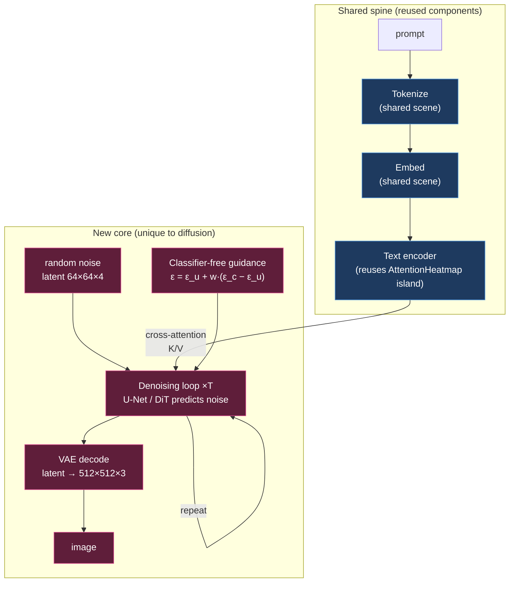
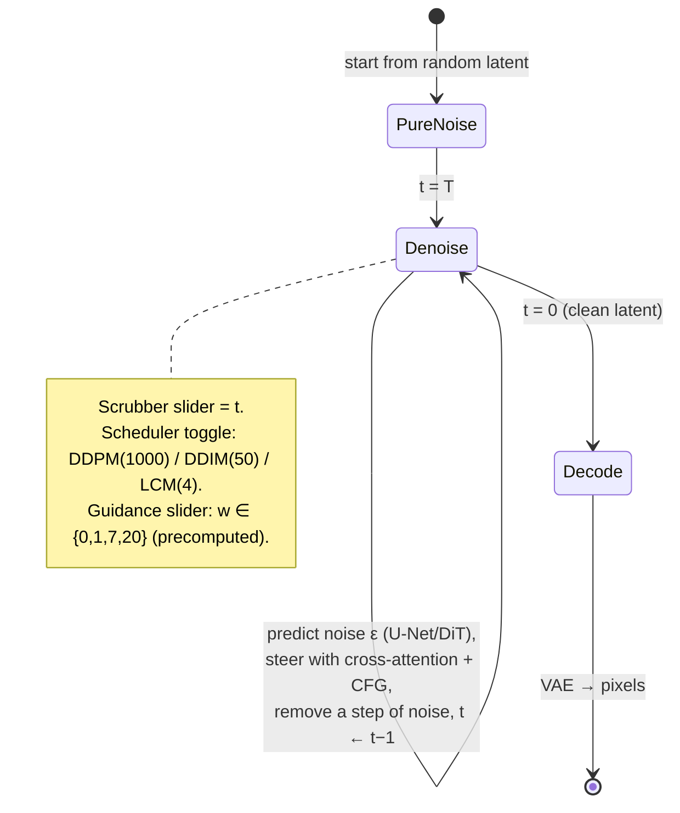
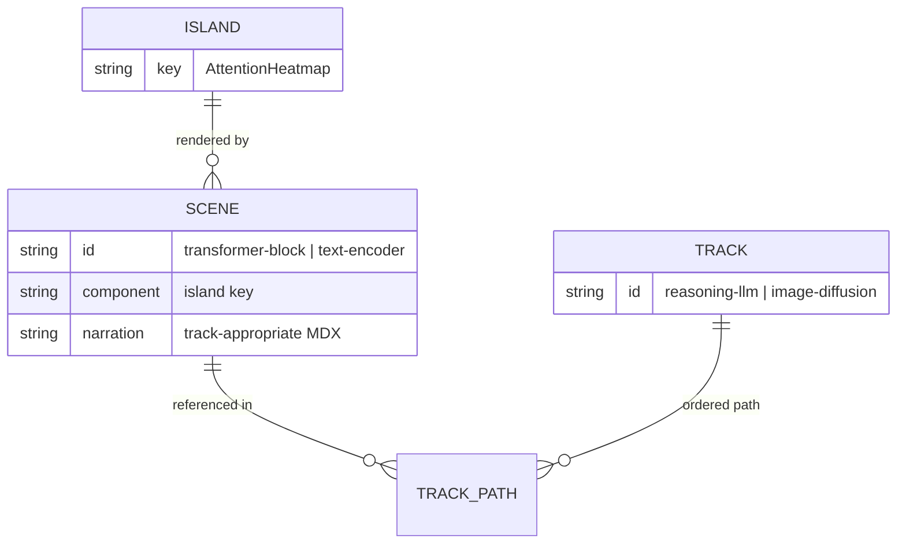

# Next Tracks: Roadmap And The Image‑Diffusion Track

## Problem Statement

The MVP shipped: a live, deployed **Reasoning‑LLM track** built on a shared
spine of scenes (tokenize → embed → attention → sample) plus reasoning‑specific
scenes. The whole point of the [scene‑graph architecture](0002_[_]_MODEL_TAXONOMY_AND_SHARED_SCENE_ARCHITECTURE.md)
was that **more model types are additive**. Now we cash that in.

This exploration answers: **which model tracks do we build next, in what order,
and exactly how do we build the first one?** The user wants to "start
implementing more explanations of other types of AI" — so this doc both
sequences the roadmap and specifies the next track in enough detail to hand
straight to `/implement`.

Builds on [0001 architecture](0001_[_]_INTERACTIVE_SCROLLYTELLING_ARCHITECTURE.md),
[0002 taxonomy & shared scenes](0002_[_]_MODEL_TAXONOMY_AND_SHARED_SCENE_ARCHITECTURE.md),
and [0003 the MVP](0003_[_]_MVP_REASONING_LLM_TRACK.md).

## Executive Summary

**Build two tracks next, in this order:**

1. **Chat LLM (finish the stub) — a ~half‑day quick win.** `chat-llm.json`
   already exists (`available: false`) reusing the shared spine. Add **one**
   scene — post‑training (instruction tuning + RLHF) — flip it live, and we have
   a third tab that *proves the "shared + 1" thesis* at almost zero cost. It's
   also the natural "diff" the reasoning track keeps referring to.

2. **Image Diffusion (text‑to‑image) — the flagship "other type of AI."** This is
   the visually striking, genuinely different model family that makes the site
   feel like it covers more than LLMs. It **reuses the shared front‑end** (the
   prompt is tokenized → embedded → run through a Transformer **text encoder** —
   literally our existing components) and then hands off to a **completely new
   core**: a VAE latent space, an iterative **denoising loop**, **cross‑attention**
   text conditioning, and **classifier‑free guidance**.

Critical delivery decision, learned from the field's best explainer (Georgia
Tech's **Diffusion Explainer**, which *precomputes everything* because live
in‑browser generation is impractical): **the diffusion track's core lesson must
not depend on running a real diffusion model in the browser.** Ship the denoising
visualization from **precomputed frames** (or a schematic canvas noise→image for
a zero‑asset MVP), with an *optional* WebGPU "generate your own" mode gated behind
feature detection. This mirrors how the LLM track ships a live tokenizer + curated
data rather than a mandatory 2 GB model download.

**Roadmap after diffusion** (ranked by impact × low effort × spine reuse):
**Embeddings/RAG → Mixture‑of‑Experts → Vision‑Language Model**, with an
image‑classifier/CNN as a light palette‑cleanser and **video diffusion** as an
eventual capstone (it's "diffusion + time" and mostly re‑teaches diffusion).

An architectural refinement falls out of this work: **the reusable unit is the
island (the expensive interactive component), and scenes are cheap MDX narration
wrappers around islands.** Tracks share *islands*; they may share a scene
outright (tokenize) or wrap a shared island in track‑specific narration (the
diffusion "text encoder" reuses the attention island with a diffusion framing).

## Current State In The Repository

The site is live at `https://crs48.github.io/ai-explained/`. Relevant seams a new
track touches:

- **Track definitions** — `src/content/tracks/reasoning-llm.json` (live, 13
  scenes) and `src/content/tracks/chat-llm.json` (`available: false`, spine
  only). A track is an ordered `path` of `{ scene, highlight }`.
- **Scene collection + schema** — `src/content.config.ts` defines the `scenes`
  (MDX; frontmatter `title/subtitle/kind/component/concepts`) and `tracks`
  collections.
- **Scenes** — `src/content/scenes/*.mdx`. Shared spine:
  `intro.mdx`, `tokenize.mdx`, `embed.mdx`, `transformer-block.mdx`,
  `sample.mdx`, `live-model.mdx`. Reasoning‑unique: `cot.mdx`,
  `test-time-scaling.mdx`, `self-recursion.mdx`, `training-reasoning.mdx`,
  `strategy-zoo.mdx`, `reasoning-effort.mdx`, `faithfulness.mdx`.
- **Islands** — `src/components/islands/` (12 today: `Tokenizer`,
  `EmbeddingSpace`, `AttentionHeatmap`, `SamplingPlayground`, plus the reasoning
  set and `LiveModel`). Registered in
  `src/components/islands/registry.ts` (`ISLAND_KEYS`, `isIslandKey`).
- **Island rendering** — `src/components/SceneGraphic.astro` maps a scene's
  `component` string to a literal `<Island client:visible />` tag (literal tags
  are required for Astro hydration).
- **Rendering shell** — `src/components/TrackView.astro` resolves a track's
  scenes and renders `SceneScaffold.astro` (sticky graphic + scrolling
  narration) with `PipelineRail.tsx` (shared=teal / unique=magenta rail) and
  `TrackTabs.astro` (the tab bar; `available: false` shows "soon").
- **Precomputed data** — `src/data/example.json` (curated LLM values);
  `scripts/precompute.mjs` (optional regen). A diffusion track adds analogous
  data under `src/data/`.

**What adding a track requires today** (from the [README](../../README.md)):
new scene MDX files, register any new island in `registry.ts` + `SceneGraphic.astro`,
add a `tracks/<name>.json`. Shared scenes are referenced, not copied — no changes
to existing scenes. That contract is what makes this cheap.

## External Research

Full notes condensed; sources listed at the end.

### The key prior art: Diffusion Explainer (Polo Club, IEEE VIS 2024)

`poloclub.github.io/diffusion-explainer` — the definitive interactive Stable
Diffusion explainer, and our north star. **It precomputes everything** (the paper
states live per‑prompt WebGPU generation is infeasible):

- **13 template prompts** (pick, don't type), **guidance‑scale** snapped to
  **{0, 1, 7, 20}**, a few discrete **seeds**, **50 fixed timesteps** with a
  scrubber.
- Progressive, expand‑in‑place views: architecture → **CLIP text encoder** →
  **U‑Net denoising** across timesteps → a **two‑prompt UMAP divergence** view
  (change one keyword, watch trajectories split).
- **What to steal:** precompute‑everything; the **timestep denoising scrubber**;
  **discrete** hyperparameter sliders (every state is a cached asset); the
  one‑keyword two‑prompt comparison; expand‑in‑place progressive disclosure.

Other references: **Jay Alammar — Illustrated Stable Diffusion** (canonical
diagram vocabulary: ClipText → UNet+Scheduler → Autoencoder Decoder; tensor‑shape
labels like 77×768 and 64×64×4); **Lilian Weng — What are Diffusion Models?**
(the math; linear vs cosine noise schedules; "predicted noise as an arrow steering
the latent back to data"); **Diffusion‑Explorer** (helblazer811) — a cheap **2D
particle‑flow** animation of noise→data manifold that runs live without any image
model.

### The diffusion pipeline (accurate, scene‑ready)

- **Core idea:** start from pure Gaussian noise; iteratively **predict and remove**
  noise to reveal an image. Training adds noise (forward); generation removes it
  (reverse). **DDPM** ~1000 steps (stochastic); **DDIM** deterministic, ~20–50;
  modern schedulers (Euler, DPM++, UniPC) 20–50; **LCM/Turbo** 1–4 steps.
- **Latent diffusion (why it's fast):** a **VAE encoder** compresses 512×512×3 →
  **64×64×4** (~48× fewer elements); the loop runs in latent space; a **VAE
  decoder** returns pixels. SD3/FLUX use a **16‑channel** VAE.
- **Denoiser:** **U‑Net** (SD1.x/2.x/SDXL — conv encoder‑decoder + skip
  connections + self/cross‑attention) vs **DiT/MMDiT** (SD3/PixArt/FLUX —
  patchify the latent into tokens, run transformer blocks; timestep via **adaLN**).
- **Text conditioning = cross‑attention:** the prompt is encoded (CLIP, and/or
  T5) into embeddings (SD1.5: 77×768) injected every step via **cross‑attention**
  — the image latent supplies **Queries**, the text supplies **Keys/Values**.
  *Same Q·Kᵀ→softmax→V math as our LLM self‑attention; the twist is Q and K/V come
  from different modalities.*
- **Classifier‑free guidance (CFG):** each step run the denoiser twice
  (conditional ε_c, unconditional ε_u); extrapolate ε = ε_u + w·(ε_c − ε_u).
  w≈7 typical; high w = strong adherence but artifacts. **Negative prompts**
  replace the unconditional branch with a "what to avoid" encoding.

### Reference numbers (verify before publishing; ⚠️ = flagged)

| Model | Denoiser | Denoiser params | Text encoder(s) | Latent | Steps |
|---|---|---|---|---|---|
| SD 1.5 | U‑Net | ~860M | CLIP ViT‑L/14 (77×768) | 64×64×4 | 20–50 |
| SDXL | U‑Net | ~2.6B | CLIP‑L + OpenCLIP‑bigG | 128×128×4 | 25–40 |
| SD3/3.5 | MMDiT | ~2.5B/8.1B ⚠️ | CLIP‑L + bigG + T5‑XXL | 16‑ch | ~28 |
| FLUX.1 | MMDiT (rectified flow) | ~12B ⚠️ | T5‑XXL + CLIP‑L | 16‑ch | schnell 1–4 |
| PixArt‑α | DiT | ~0.6B ⚠️ | T5‑XXL only | 4‑ch | ~20 |

Footnote for the site: **SD3/FLUX use rectified‑flow/flow‑matching**, a
straight‑line‑path variant of the classic "add/remove noise" story — worth a
one‑line caveat.

### In‑browser feasibility

Real client‑side diffusion is possible (**diffusers.js** + ONNX Runtime Web +
WebGPU) but heavy: needs WebGPU (~70% support), ≥4 GB VRAM, and ~1–2 GB downloads;
aggressive quantization has hit **~250 MB** (Butterman, 2025). **LCM/SD‑Turbo/SDXS**
(1–4 steps) make live demos tractable on capable desktops. **transformers.js has
no text‑to‑image pipeline** — use diffusers.js for live gen. **Recommendation:
precompute (or schematic) for the core lesson; optional WebGPU "generate your own"
as a bonus**, exactly as Diffusion Explainer concluded.

## Key Findings

1. **The diffusion front‑end IS our shared spine.** Tokenize + embed + a
   Transformer text encoder are already built. Diffusion reuses them and only
   *relabels* the attention scene as "text encoder." Genuinely additive.
2. **The reusable unit is the island, not the scene.** Scenes are cheap MDX
   narration wrappers. The diffusion "text encoder" can reuse the
   `AttentionHeatmap` island under a diffusion‑framed scene. This is a small,
   healthy refinement to the 0002 model.
3. **Precompute, don't live‑generate, for the core.** The best explainer in the
   world (Diffusion Explainer) precomputes everything for exactly our constraints
   (static host, any device). Live WebGPU is a bonus, never a dependency.
4. **A zero‑asset MVP is possible.** A canvas‑based schematic denoiser (add/remove
   Gaussian noise over a target image, or a 2D particle‑flow toy) teaches
   noise→image with **no** Stable‑Diffusion asset pipeline — shippable immediately,
   upgradeable to real precomputed frames later.
5. **Chat LLM is nearly free and high‑value.** One post‑training scene flips a
   third tab live and demonstrates the whole reuse thesis. Do it first as a warm‑up.
6. **Cross‑attention is the "aha" that ties the two tracks together** — same math
   as LLM self‑attention, crossing text→image. Reuses the attention component.

## Options And Tradeoffs

### Which track is next?

| Candidate | "Different AI" impact | Effort | Spine reuse | Verdict |
|---|---|---|---|---|
| **Chat LLM (finish stub)** | Low (still an LLM) | Very low | ~100% | **Do first** (warm‑up, proves reuse) |
| **Image Diffusion** ⭐ | **High** (clearly a new family) | Medium | Front‑end reused, new core | **Flagship next** |
| Embeddings/RAG | Medium | Low | Very high | After diffusion |
| Mixture‑of‑Experts | Medium | Low–med | Very high (forks the FFN) | After embeddings |
| Vision‑Language Model | High | Medium | High (adds image encoder) | Pairs with diffusion |
| Image classifier / CNN | Medium | Low | Low (convolutions) | Palette‑cleanser |
| Video diffusion | Highest | Highest | Reuses diffusion | Capstone |

Diffusion wins as the flagship: maximal "other type of AI" payoff, best prior art
to borrow, and it still reuses the front‑end so it showcases the architecture.

### How to render the denoising visualization

| Option | Pros | Cons |
|---|---|---|
| **Schematic canvas noise↔image (zero assets)** ⭐ MVP | ships now, no model, any device, deterministic | not "real" SD output; label as illustrative |
| **Precomputed SD frames** (Diffusion Explainer approach) | truthful, beautiful, curated prompts | requires an offline asset pipeline (run diffusers once), asset weight |
| **Live WebGPU (LCM/Turbo)** | "generate your own" wow | ~70% support, 250 MB–1 GB, desktop‑only; bonus not core |

Recommendation: **schematic canvas for the MVP scrubber**, structured so the same
`DenoiseScrubber` island can later swap its frame source to precomputed SD frames;
add the WebGPU bonus last.

### How to reframe shared scenes per track (the "text encoder" problem)

`transformer-block.mdx` ends "the model is ready to turn that vector back into a
word" — wrong for diffusion (it produces conditioning). Options:

| Option | Pros | Cons |
|---|---|---|
| **Track‑specific scene reusing the shared island** ⭐ | reuses the expensive island; correct narration; no schema change | one extra small MDX per divergent scene |
| Add `overrideMdx` to the schema (0002's idea) | one scene, per‑track text | schema + `TrackView` change; more machinery |
| Make shared narration generic | one scene everywhere | bland; loses the LLM‑specific punch |

Recommendation: **track‑specific scene wrapping the shared island** (a
`text-encoder.mdx` with `component: AttentionHeatmap`). Cheap, correct, and it
formalizes "islands are the shared unit."

## Recommendation

**Phase 1 — Chat LLM (warm‑up).** Add `src/content/scenes/alignment.mdx` (SFT +
RLHF; a small `Alignment` island or reuse a simple before/after), append it to
`chat-llm.json` after `sample`, mark it `highlight`, flip `available: true`.
Third live tab; proves reuse.

**Phase 2 — Image Diffusion (flagship).** New track `image-diffusion.json` whose
path is: **shared front‑end** (`diffusion-intro`, `tokenize`, `embed`,
`text-encoder`) → **new core** (`latent-space`, `denoising` ⭐highlight,
`denoiser-net`, `cross-attention`, `guidance`, `diffusion-recap`). New islands:
`DenoiseScrubber`, `LatentSpace`, `CrossAttention`, `GuidanceScale`,
`DenoiserToggle` (U‑Net↔DiT). Ship schematic/precomputed; WebGPU bonus optional.

**Phase 3+ — Roadmap:** Embeddings/RAG → MoE → VLM → CNN (palette‑cleanser) →
Video (capstone).

### Roadmap

```mermaid
flowchart LR
    R["✅ Reasoning LLM<br/>(shipped)"] --> C["Chat LLM<br/>warm-up · ~½ day"]
    C --> D["⭐ Image Diffusion<br/>flagship next"]
    D --> E["Embeddings / RAG<br/>highest reuse"]
    E --> M["Mixture-of-Experts<br/>forks the FFN"]
    M --> V["Vision-Language Model<br/>adds image encoder"]
    V --> N["Image classifier / CNN<br/>palette-cleanser"]
    N --> VID["Video diffusion<br/>capstone"]
    classDef done fill:#14532d,stroke:#22c55e,color:#fff;
    classDef flag fill:#5f1e3a,stroke:#ec4899,color:#fff;
    class R done;
    class D flag;
```



### The diffusion pipeline: shared spine + new core



### The denoising loop (state diagram)



### Islands are the shared unit; scenes wrap them



## Example Code

### Phase 2 — the diffusion track (`src/content/tracks/image-diffusion.json`)

```json
{
  "title": "Image Diffusion",
  "family": "diffusion",
  "order": 3,
  "tagline": "How a text prompt becomes a picture — by sculpting it out of noise.",
  "available": true,
  "path": [
    { "scene": "diffusion-intro" },
    { "scene": "tokenize" },
    { "scene": "embed" },
    { "scene": "text-encoder" },
    { "scene": "latent-space" },
    { "scene": "denoising", "highlight": true },
    { "scene": "denoiser-net" },
    { "scene": "cross-attention" },
    { "scene": "guidance" },
    { "scene": "diffusion-recap" }
  ]
}
```

### A track‑specific scene reusing a shared island (`text-encoder.mdx`)

```mdx
---
title: "Step 3 — The text encoder"
subtitle: "Your prompt runs through a Transformer — the same self-attention as an LLM — but its output steers an image instead of predicting a word."
kind: shared
component: AttentionHeatmap
concepts: ["CLIP", "text encoder", "conditioning"]
---

The prompt you just tokenized and embedded now flows through a **Transformer text
encoder** (CLIP, and in newer models T5). It's the *same self-attention* you saw
in the LLM track... but instead of predicting the next word, its output becomes a
**conditioning signal** the image model will follow.
```

### New island keys (`registry.ts`) and rendering (`SceneGraphic.astro`)

```ts
// registry.ts — append:
"DenoiseScrubber", "LatentSpace", "CrossAttention", "GuidanceScale", "DenoiserToggle",
// (Chat LLM phase adds "Alignment")
```

```astro
{/* SceneGraphic.astro — append literal tags */}
{component === "DenoiseScrubber" && <DenoiseScrubber client:visible />}
{component === "LatentSpace" && <LatentSpace client:visible />}
{component === "CrossAttention" && <CrossAttention client:visible />}
{component === "GuidanceScale" && <GuidanceScale client:visible />}
{component === "DenoiserToggle" && <DenoiserToggle client:visible />}
```

### The zero‑asset schematic denoiser (island sketch)

```tsx
// DenoiseScrubber.tsx — teaches noise→image with NO diffusion model.
// Precompute a forward "noising" sequence from a target image on a <canvas>,
// then the slider plays it in reverse as "denoising".
function buildFrames(img: ImageData, steps: number): ImageData[] {
  // frame[k] = img + Gaussian noise scaled by ᾱ schedule; store steps frames
}
// Slider t → draw frames[t]; scheduler toggle changes how many frames are shown
// (DDPM 1000 / DDIM 50 / LCM 4). Gate any autoplay on prefers-reduced-motion.
```

> Later upgrade: swap `buildFrames` for a loader that reads **precomputed SD
> frames** from `src/data/diffusion/<prompt>/<seed>/<guidance>/*.webp`, generated
> once by an offline `scripts/gen-diffusion-frames.py` (Python + 🧨 diffusers).

## Risks And Open Questions

- **Asset pipeline for real frames.** Truthful SD frames need an offline
  generation step (Python/diffusers/Colab) — not runnable in this repo's build.
  Mitigation: ship the **schematic** denoiser first (zero assets); add real frames
  as a documented, optional follow‑up.
- **Cross‑attention overlay needs per‑pixel attention maps.** For real prompts
  that means extracting attention from a real model (offline). Mitigation: MVP
  uses a **curated/illustrative** overlay (hand‑authored region masks per demo
  word), clearly labeled — same honesty stance as the LLM attention heatmap.
- **Flow‑matching vs DDPM.** SD3/FLUX use rectified flow, not classic DDPM. Keep
  the "add/remove noise" framing but add a one‑line caveat so it stays accurate.
- **Shared‑scene narration drift.** Reusing `transformer-block` verbatim in
  diffusion is subtly wrong; the `text-encoder` wrapper scene fixes it but sets a
  precedent (each divergent track may want its own wrapper). Acceptable; cheap.
- **`intro` is not actually shared.** Each track needs its own intro framing
  (`diffusion-intro`), so `intro.mdx` should be treated as reasoning‑specific, not
  a shared scene. Minor bookkeeping.
- **WebGPU bonus scope.** Live diffusion is desktop‑only and heavy; strictly
  optional and feature‑detected, never on the core path.
- **Tab bar growth.** At 5+ tracks the `TrackTabs` bar needs grouping/overflow
  (e.g. "Language / Image / Other"). Not urgent at 3.

## Implementation Checklist

**Phase 1 — Chat LLM (warm‑up)**
- [x] Author `src/content/scenes/alignment.mdx` (base → SFT → RLHF; why ChatGPT is
      helpful/aligned), `kind: unique`.
- [x] Build a small `Alignment` island (side‑by‑side base‑vs‑aligned answer;
      optional "rank these two responses" like the human labeler) + register it.
- [x] Append `alignment` (`highlight: true`) to `chat-llm.json`; set
      `available: true`; give it a real `tagline`.
- [x] Verify `/chat-llm` builds and shares scenes 1–4 with no changes to them.

**Phase 2 — Image Diffusion (flagship)**
- [x] Author scenes: `diffusion-intro`, `text-encoder`, `latent-space`,
      `denoising`, `denoiser-net`, `cross-attention`, `guidance`,
      `diffusion-recap` (reuse `tokenize`, `embed`).
- [x] Build islands: `DenoiseScrubber` (schematic canvas noise↔image + scheduler
      toggle), `LatentSpace` (encode/decode animation + tensor‑shape labels),
      `CrossAttention` (prompt‑word → image‑region overlay), `GuidanceScale`
      (two‑arrow CFG + discrete w slider), `DenoiserToggle` (U‑Net ↔ DiT).
- [x] Register all new islands in `registry.ts` + `SceneGraphic.astro`.
- [x] Add `src/data/diffusion.json` (curated prompts, region masks, schedule
      curve, illustrative frame params).
- [x] Create `image-diffusion.json` track (path above; `denoising` highlighted).
- [x] Gate any animation on `prefers-reduced-motion`; keep SSR‑safe (read motion
      in `useEffect`, per the LLM islands).
- [ ] (Optional) `scripts/gen-diffusion-frames.py` + a WebGPU "generate your own"
      island behind feature detection.

**Phase 3 — Roadmap kickoff**
- [ ] Open a follow‑up exploration for **Embeddings/RAG** (highest reuse, next).

## Validation Checklist

- [x] `astro build` produces `/chat-llm` and `/image-diffusion` routes; tab bar
      shows all three live tracks.
- [x] The diffusion track reuses `tokenize` + `embed` with **no edits** to those
      scenes (reuse proven); the pipeline rail dims them (teal) and highlights
      `denoising` (magenta core).
- [x] The denoising scrubber morphs noise → image smoothly and works with
      JavaScript‑only enhancement (narration readable without JS).
- [x] Scheduler toggle changes the visible step count (DDPM/DDIM/LCM); guidance
      slider changes the output at w ∈ {0,1,7,20}.
- [x] Cross‑attention overlay: selecting a prompt word highlights the intended
      image region; labeled "illustrative."
- [x] Production console clean across all diffusion scenes; Lighthouse
      Performance ≥ 90 / Accessibility ≥ 95 maintained.
- [x] A reader can articulate: "the prompt uses the same tokenize→embed→transformer
      front‑end as an LLM, then a different engine denoises an image, steered by the
      words through cross‑attention."
- [x] Chat LLM: a reader can state "chat = base LLM + instruction tuning + RLHF."

## References

- Diffusion Explainer — https://poloclub.github.io/diffusion-explainer/ · paper https://arxiv.org/abs/2404.16069 · code https://github.com/poloclub/diffusion-explainer
- Illustrated Stable Diffusion (Alammar) — https://jalammar.github.io/illustrated-stable-diffusion/
- Lilian Weng, "What are Diffusion Models?" — https://lilianweng.github.io/posts/2021-07-11-diffusion-models/
- Diffusion‑Explorer (2D flow toy) — https://github.com/helblazer811/Diffusion-Explorer
- U‑Net→DiT evolution — https://iclr-blogposts.github.io/2026/blog/2026/diffusion-architecture-evolution/
- SDXL — https://arxiv.org/pdf/2307.01952 · SD3/3.5 — https://huggingface.co/blog/sd3 · https://github.com/Stability-AI/sd3.5 · PixArt — https://github.com/PixArt-alpha/PixArt-alpha
- Classifier‑free guidance — https://apxml.com/courses/intro-diffusion-models/chapter-6-conditional-generation-diffusion/classifier-free-guidance · Negative prompts — https://arxiv.org/html/2406.02965v1
- In‑browser diffusion — https://github.com/dakenf/diffusers.js · 250 MB SD (Butterman) — https://www.leebutterman.com/2025/03/01/running-stable-diffusion-in-250-megabytes-in-onnx-and-webgpu.html · ONNX Runtime Web + WebGPU — https://opensource.microsoft.com/blog/2024/02/29/onnx-runtime-web-unleashes-generative-ai-in-the-browser-using-webgpu/ · LCM‑LoRA — https://huggingface.co/blog/lcm_lora
- HF Diffusers annotated SD — https://huggingface.co/blog/stable_diffusion
- Repo seams: `src/content.config.ts`, `src/content/tracks/*.json`, `src/content/scenes/*.mdx`, `src/components/islands/registry.ts`, `src/components/SceneGraphic.astro`, `src/components/TrackView.astro`
