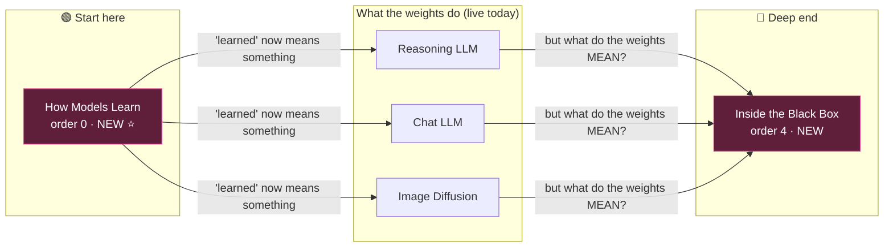
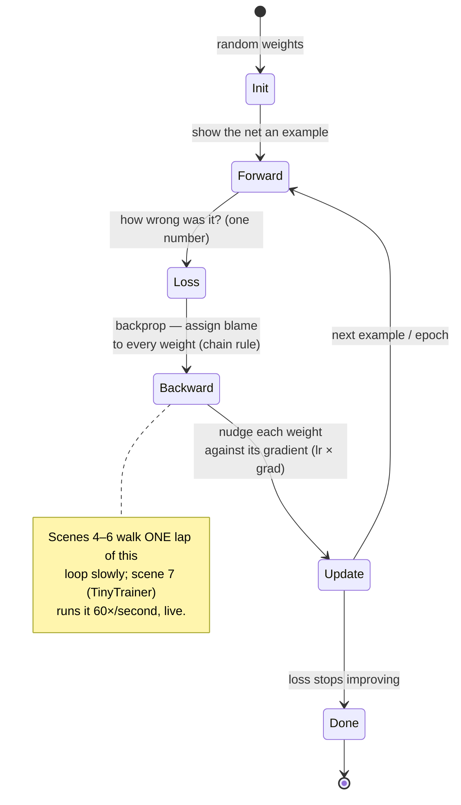
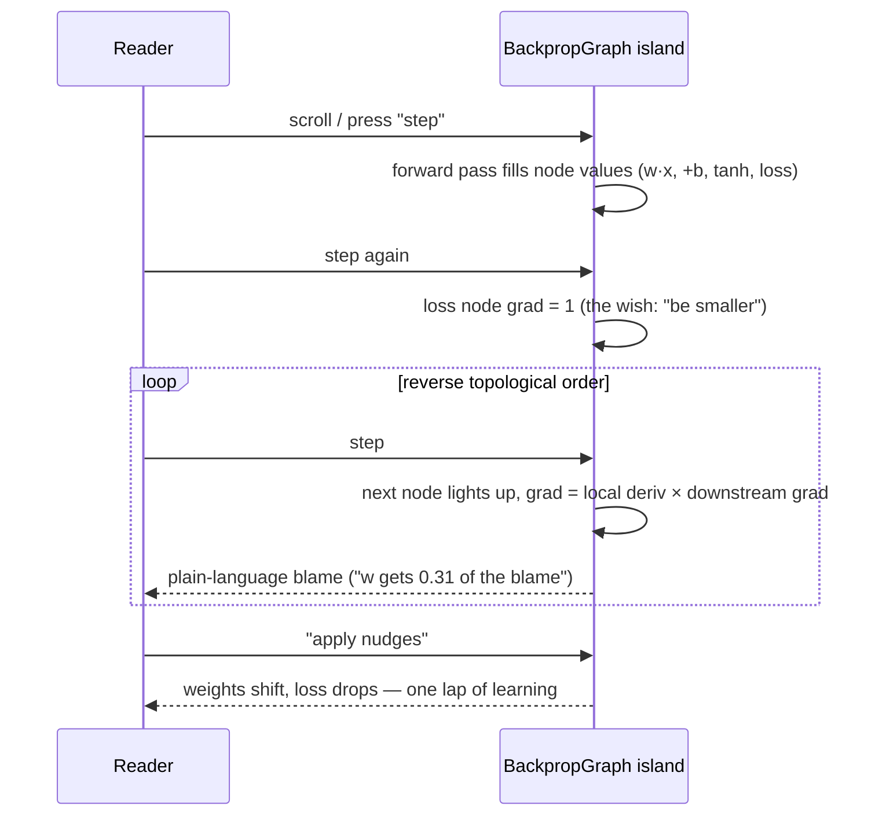

# Foundations And LLM Internals: Explaining Neural Networks, Gradient Descent, And The Nuanced Machinery

## Problem Statement

Every live track on the site leans on the same handwave. `embed.mdx` says
"these vectors are *learned*." `transformer-block.mdx` says heads "learn"
relationships. `training-reasoning.mdx` and `alignment.mdx` describe *what*
training does but never *how* a number inside the model actually changes. The
site explains inference beautifully and treats **learning itself as a black
box** — and it has nothing yet on the *nuanced* interior of LLMs (features,
superposition, circuits, steering) that makes modern AI genuinely strange.

The prompt: *"What would it look like to explain neural networks and gradient
descent and kind of more nuanced features of AI and LLMs?"*

That's two distinct gaps, and this exploration designs both:

1. **The missing on-ramp** — neural networks, loss, gradient descent, backprop:
   the machine that makes "learned" a real word. Upstream of every track we have.
2. **The missing deep end** — the nuanced internals of LLMs: features and
   superposition, induction heads, the logit lens, feature steering. Downstream
   of every track we have.

Builds on [0001 architecture](0001_[_]_INTERACTIVE_SCROLLYTELLING_ARCHITECTURE.md),
[0002 taxonomy & shared scenes](0002_[_]_MODEL_TAXONOMY_AND_SHARED_SCENE_ARCHITECTURE.md),
[0003 the MVP](0003_[_]_MVP_REASONING_LLM_TRACK.md), and
[0004 next tracks](0004_[_]_NEXT_TRACKS_IMAGE_DIFFUSION.md).

## Executive Summary

**Build two tracks, in this order:**

1. **"How Models Learn" (foundations) — the flagship.** A track with `order: 0`
   that sits *first* in the tab bar as the site's on-ramp: a single neuron →
   a network → loss → **gradient descent** (⭐ highlight) → backprop → a *live
   trainable network in the browser* → generalization → a bridge scene that
   hands the reader back to the LLM tracks ("now do this with 10¹¹ knobs and
   the whole internet"). The centerpiece island is a **TF-Playground-style tiny
   MLP that trains live on 2D toy data** — feasibility is settled: TensorFlow
   Playground (Apache-2.0) and ConvNetJS prove a hand-rolled ~150-line scalar
   backprop trains small nets at 60fps in plain JS/TS. **No ML library, no
   assets, no WebGPU.** Everything runs live; nothing needs precomputing.

2. **"Inside the Black Box" (LLM internals) — the nuance track.** The advanced
   material for readers who finished an LLM track: what the learned weights
   *mean*. Features & **superposition** (train Anthropic's toy model live in
   the browser — it's <100 parameters — and watch feature directions settle
   into antipodal pairs and pentagons, ⭐ highlight), induction heads (reusing
   the attention-heatmap island's visual language), the logit lens (curated
   per-layer predictions), and **feature steering** (a Golden-Gate-Claude-style
   slider over precomputed outputs). This track is where "kind of more nuanced
   features" lives, and it's the first track whose subject is *the weights
   themselves* rather than a pipeline.

Both tracks fit the existing architecture with **zero schema changes**: new
scenes + new islands + a track JSON each. The foundations track is the first
with near-zero *spine* reuse — but it inverts the dependency: its scenes
(`loss`, `gradient-descent`, `backprop`) become new **shared** material that
future training-related scenes can reference, and the existing tracks' "it's
learned" handwaves get a place to point.

This amends 0004's roadmap: foundations jumps the queue ahead of
Embeddings/RAG because it's the missing prerequisite for *every* track,
already-live and future.

## Current State In The Repository

The seams a new track touches (unchanged since 0004, now with 3 live tracks):

- **Track definitions** — `src/content/tracks/reasoning-llm.json` (order 1),
  `chat-llm.json` (order 2), `image-diffusion.json` (order 3). A track is an
  ordered `path` of `{ scene, highlight }`. `order: 0` is free — the
  foundations track can take the first tab without renumbering anything.
- **Scene schema** — `src/content.config.ts`: MDX frontmatter
  `title/subtitle/kind(shared|unique)/component/concepts`. No changes needed.
- **Scenes** — `src/content/scenes/*.mdx` (23 today). The learning handwaves
  live in `embed.mdx` ("these vectors are *learned*"), `transformer-block.mdx`
  ("each learning a different kind of relationship"),
  `training-reasoning.mdx` (RLVR, assumes gradient-following is understood),
  `alignment.mdx` (SFT/RLHF, same assumption).
- **Islands** — `src/components/islands/` (18 registered in `registry.ts`).
  Conventions to follow (verified in `TrainingReasoning.tsx`): default-export
  React component, `prefersReducedMotion()`/`onReducedMotionChange` from
  `src/lib/motion.ts` read in `useEffect` (SSR-safe), CSS-variable theming
  (`--color-shared-400` teal / `--color-unique-400` magenta /
  `--color-surface-2` etc.), `aria-live` on updating readouts,
  `suppressHydrationWarning` on inputs.
- **Island rendering** — `SceneGraphic.astro` needs one literal
  `<Island client:visible />` tag per new island (Astro hydration requires
  literal tags; `registry.ts` just validates keys).
- **Rendering shell** — `TrackView.astro` + `SceneScaffold.astro` +
  `PipelineRail.tsx` (shared=teal / unique=magenta) + `TrackTabs.astro`. A
  fourth and fifth tab fit; at 5+ the tab bar wants grouping (0004 flagged
  this — it becomes real now).
- **Data & scripts** — `src/data/*.json` for curated values;
  `scripts/precompute.mjs` for optional regen. The internals track adds
  curated data (logit-lens table, steering outputs, induction-head pattern);
  the foundations track needs **no data files at all** — everything is
  computed live.
- **Cross-attention precedent** — `cross-attention.mdx` already teaches "same
  Q·Kᵀ math, different wiring." The internals track's induction-heads scene
  extends exactly that visual language.

**What the contract requires per track** (from the README): author new scenes,
register new islands in `registry.ts` + `SceneGraphic.astro`, add
`tracks/<name>.json`. Shared scenes referenced, never copied.

## External Research

Condensed from a full prior-art sweep (sources in References).

### Neural nets & gradient descent — the field's best tricks

- **TensorFlow Playground** (`playground.tensorflow.org`, **Apache-2.0**) — the
  canonical trainable-MLP-in-browser. Hand-rolled scalar backprop in
  TypeScript (`nn.ts`, no ML library), 4 toy 2D datasets (circle, XOR,
  gaussians, spiral), decision boundary painted by evaluating the net over a
  ~100×100 grid into a canvas each frame. The killer detail: **every hidden
  neuron is rendered as its own mini decision-boundary thumbnail**, making
  "features compose" visceral. License permits lifting the approach (or code)
  outright.
- **ConvNetJS classify2d** (Karpathy, MIT, 2014) — same idea a decade ago on
  far weaker hardware; adds a "watch the hidden layer bend space" companion
  view. Proof that plain JS suffices — pre-WebGL-compute.
- **3Blue1Brown** (gradient descent / backprop chapters) — the metaphor kit:
  cost surface as a **hilly landscape with a ball rolling downhill** (with the
  honest "this 2D hill is a projection of a million-D space" disclaimer);
  gradient as a **table of per-knob nudges**; backprop as **blame propagating
  backward** through the network — chain rule without calculus.
- **Ben Frederickson, "Numerical Optimization"** — the single best gradient-
  descent interaction: **click anywhere on a contour plot to drop the ball**,
  watch the optimizer path; sliders for learning rate; divergence when lr is
  too high.
- **Distill, "Why Momentum Really Works"** — slider-coupled optimizer
  trajectories on contours; small-multiples of convergence behavior.
- **Li et al. 2018, "Visualizing the Loss Landscape of Neural Nets"** — real
  loss surfaces are precomputable to a JSON grid. But for a *2-parameter* net
  we can plot the **true** loss surface live — a stronger pedagogical move
  almost nobody makes, because real explainers always start too big.
- **R2D3, "A Visual Introduction to Machine Learning"** — the strongest pure
  scrollytelling mechanic found: data points flying into model structure as
  you scroll; part II is the canonical bias/variance (overfitting) treatment.
- **Feasibility verdict:** a 2-16-16-1 MLP is ~340 parameters; one SGD step on
  300 points plus a 100×100 boundary repaint is ~10⁶ flops — modern JS does
  10⁸–10⁹ per frame. **Dozens of epochs per animation frame at 60fps in plain
  TS.** tfjs would be *slower* (per-op dispatch overhead) and costs ~1MB+
  bundle — wrong tool for tiny nets on an islands site.

### LLM internals — making interpretability lay-readable

- **Anthropic, "Toy Models of Superposition"** (transformer-circuits.pub) —
  the geometric picture: more features than dimensions forces features into
  **superposition**; in a 2D hidden space they settle into antipodal pairs →
  pentagons as sparsity rises. The toy model is a tiny ReLU autoencoder,
  **<100 parameters — trainable live in the browser**, animating the feature
  directions as they organize. Arguably the single best "nuanced internals"
  interactive available to a static site.
- **Anthropic, "Scaling Monosemanticity" / Golden Gate Claude** — feature
  steering is the most *graspable* interpretability result: crank the bridge
  feature, the model self-identifies as the bridge. Honest to mimic with a
  **precomputed steering slider** (canned outputs at discrete steering
  values) — same honesty stance as our curated attention heatmap.
- **Anthropic, "On the Biology of a Large Language Model"** (2025 attribution
  graphs) — multi-step-reasoning circuits ("Dallas → Texas → Austin"), poetry
  planning. Too heavy to reproduce; right to *cite and diagram* in narration.
- **Induction heads** (transformer-circuits; Bau Lab's interactive demo) — the
  `[A][B] … [A] → [B]` pattern-completion circuit; the canonical "circuit" a
  lay reader can verify with their own eyes on an attention heatmap. Reuses
  our existing attention visual language directly.
- **Logit lens** (nostalgebraist) — decode the residual stream at *every*
  layer, watch the prediction sharpen from noise to the answer as depth
  increases. Renders as a simple table/heatmap of per-layer top tokens —
  curated data, no live model needed.
- **Neuronpedia** (open source, MIT) — real SAE feature dashboards, embeddable
  via `?embed=true` iframes and a REST API usable at build time. Optional
  garnish: real features, but an external-uptime dependency — never on the
  core path.
- **Bbycroft LLM viz** — the **scale-shock moment**: nano-GPT rendered next to
  GPT-3 at true relative size. Worth borrowing as a static SVG beat in the
  bridge scene.
- **Transformer Explainer / CNN Explainer** (Polo Club) — zoom-drill from
  architecture overview into a single operation; GPT-2 live in-browser via
  ONNX is possible but a heavyweight download — not for our core path.

## Key Findings

1. **The foundations track is the missing prerequisite, not another sibling.**
   Every live track says "learned" and points at nothing; `training-reasoning`
   and `alignment` describe optimization pressure without the optimizer. One
   track fixes the handwave for all of them — and future tracks inherit it.
2. **Live in-browser training is a solved problem at this scale.** Two
   independent existence proofs (TF Playground 2016, ConvNetJS 2014), one with
   an Apache-2.0 reference implementation. This is the rare flagship island
   with *zero* asset pipeline, *zero* precompute, and *zero* feasibility risk.
3. **The 2-parameter net is our novel move.** Everyone projects
   million-D loss surfaces down to a fake 2D hill. Start with a net that has
   literally two weights, plot the **true** loss surface, roll the **true**
   ball. Then admit the lie-to-children when scaling up — the same "honest
   asterisk" voice the site already uses in `embed.mdx`.
4. **Superposition's toy model is uniquely suited to us.** It's a real result
   from a real Anthropic paper, yet the model is tiny enough to *train live in
   the reader's browser*. The nuance track gets a flagship that is neither
   schematic nor precomputed — it's the actual experiment.
5. **The internals track completes an arc the site quietly promises.**
   Foundations (how weights are learned) → pipelines (what the weights do at
   inference) → internals (what the weights *mean*). Tabs stop being a flat
   list of model families and become a curriculum with a start and a deep end.
6. **Foundations inverts spine reuse — and that's fine.** It reuses no
   existing scene, but its `loss`/`gradient-descent`/`backprop` scenes are
   `kind: shared` by nature: any future training scene (RLHF, RLVR, diffusion
   training) can reference them. The reusable unit is still the island; the
   direction of reuse just flips.
7. **Interaction patterns worth lifting:** per-neuron boundary thumbnails
   (Playground), click-to-drop-ball on contours (Frederickson), the per-weight
   nudge table (3Blue1Brown), scroll-choreographed data points (R2D3), the
   sparsity-slider pentagon (Anthropic), the per-layer prediction ladder
   (logit lens).

## Options And Tradeoffs

### Where does this material live?

| Option | Pros | Cons | Verdict |
|---|---|---|---|
| **Two new tracks: foundations + internals** ⭐ | clean curriculum arc; each has one flagship island; foundations reusable by all future tracks | two tabs (tab bar hits 5 → needs grouping) | **Do it** |
| One mega-track ("under the hood") | one tab | 14+ scenes, two audiences (absolute beginner + advanced) forced through one scroll; violates "one distinctive highlight per track" | No |
| Sprinkle scenes into existing tracks | no new tabs | bloats every track's scroll; repeats material across tracks; the handwave never gets a home of its own | No |
| Foundations only, defer internals | smaller bite | "nuanced features" was half the prompt; internals is the differentiating content no comparable site has | Only if forced |

### How to teach gradient descent (the highlight scene)

| Option | Pros | Cons |
|---|---|---|
| **True 2-weight loss surface + droppable ball + lr slider** ⭐ | mathematically *true*, interactive, novel; divergence at high lr emerges for real | needs a careful tiny model (1 neuron, 2 params) so the surface is honest |
| Fake schematic hill (the usual) | easy | the site's voice is "honest asterisks"; a fake hill undercuts it when we *can* do the real thing |
| Precomputed Li-et-al. surface of a real net | impressive, truthful for big nets | static JSON asset; better as a *cameo* ("here's a ResNet's real landscape") than the core interaction |

### How to teach backprop

| Option | Pros | Cons |
|---|---|---|
| **Micrograd-style computational graph, scroll/step-driven** ⭐ | Karpathy's framing, nobody has built the scrollytelling version (confirmed gap); nodes light up grads in reverse topological order | new bespoke island; keep the graph tiny (one neuron, ~7 nodes) |
| 3B1B nudge-table only | very cheap | shows the *result* of backprop, not the mechanism; keep it as a *component* of the scene, not the whole |
| Skip backprop ("the gradient is computed automatically") | shortest track | the prompt literally asks for this nuance; the chain-rule-as-blame idea is teachable without calculus |

### How to render the live trainable network

| Option | Pros | Cons |
|---|---|---|
| **Hand-rolled ~150-line scalar backprop (TF-Playground style)** ⭐ | zero deps, zero bundle cost, 60fps headroom, Apache-2.0 reference to crib from | we own the numerics (keep the net small, clamp lr) |
| tfjs | "real" library | ~1MB+ bundle, *slower* for tiny nets, poison for islands site |
| Precomputed training run | deterministic | kills the magic — the whole point is the reader's browser doing the learning |

### Internals track: live vs curated per scene

| Scene | Mode | Why |
|---|---|---|
| Superposition toy | **Live training** | <100 params; the real experiment, in-browser |
| Induction heads | **Curated pattern** | real head patterns need a real model; curate the classic `[A][B]…[A]→[B]` heatmap, label "illustrative" (same stance as `AttentionHeatmap`) |
| Logit lens | **Curated table** | per-layer decodings generated once, shipped as JSON |
| Feature steering | **Precomputed outputs** | Golden-Gate-style slider over canned completions at discrete steering values; honest label |
| Neuronpedia embeds | **Optional iframe** | real SAE dashboards, but external uptime — bonus, never core |

## Recommendation

**Phase 1 — "How Models Learn" (foundations, flagship).** `order: 0`, first
tab, `family: "foundations"`. Nine scenes, five new islands, no data files:

| # | Scene | Kind | Island | Beat |
|---|---|---|---|---|
| 1 | `learn-intro` | unique | — | "Every tab on this site says *learned*. Nobody's told you what that means. Two numbers can learn." |
| 2 | `neuron` | shared | `NeuronForge` | one neuron = weights, bias, activation; drag weights, watch its little decision boundary tilt |
| 3 | `network` | shared | `NetworkComposer` | stack neurons → per-neuron boundary thumbnails compose a bent boundary (Playground's trick) |
| 4 | `loss` | shared | `LossMeter` | wrongness as a single number; drag a line through points, watch loss respond |
| 5 | `gradient-descent` ⭐ | shared | `GradientBowl` | **true** 2-weight loss surface; click to drop the ball; lr slider; divergence is real |
| 6 | `backprop` | shared | `BackpropGraph` | micrograd-style graph; step backward, grads light up as blame flows |
| 7 | `training-live` | unique | `TinyTrainer` | the payoff: full MLP trains **live** on spiral/XOR data in the reader's browser |
| 8 | `generalization` | shared | `OverfitLab` | noise + capacity sliders; memorizing vs generalizing; train/test split |
| 9 | `learn-recap` | unique | — | bridge + scale shock: your 340-param net next to GPT-3 at true relative size; "now revisit the other tabs — *learned* means this" |

**Phase 2 — "Inside the Black Box" (LLM internals).** `order: 4`, last tab,
`family: "interpretability"`. Six scenes, four new islands, one curated data
file (`src/data/internals.json`):

| # | Scene | Kind | Island | Beat |
|---|---|---|---|---|
| 1 | `internals-intro` | unique | — | we trained it, it works, and *nobody knows exactly why* — welcome to interpretability |
| 2 | `superposition` ⭐ | unique | `SuperpositionToy` | train Anthropic's toy model live; sparsity slider; watch features settle into antipodal pairs → pentagons |
| 3 | `induction-heads` | unique | `InductionHead` | the first *circuit*: `[A][B]…[A]→[B]` completion on an attention heatmap (extends the attention visual language) |
| 4 | `logit-lens` | unique | `LogitLens` | per-layer prediction ladder: watch the answer crystallize layer by layer |
| 5 | `steering` | unique | `FeatureSteering` | Golden-Gate-style slider; precomputed outputs; "features are levers" |
| 6 | `internals-recap` | unique | — | why this matters: safety, debugging, the open frontier; links to transformer-circuits.pub |

**Phase 3 — resume 0004's roadmap** (Embeddings/RAG next), with the tab bar
grouped by then (5–6 tracks): e.g. **Start here / Language / Image / Under the
hood**.

### The curriculum arc



### The training loop (heart of the foundations track)



### Backprop scene interaction (step-driven graph walk)



### Amended roadmap (0004 revision)

```mermaid
flowchart LR
    R["✅ Reasoning LLM"] --> C["✅ Chat LLM"] --> D["✅ Image Diffusion"]
    D --> F["⭐ How Models Learn<br/>(this doc, Phase 1)"]
    F --> I["Inside the Black Box<br/>(this doc, Phase 2)"]
    I --> E["Embeddings / RAG<br/>(0004 roadmap resumes)"]
    E --> M["MoE"] --> V["VLM"] --> VID["Video diffusion"]
    classDef done fill:#14532d,stroke:#22c55e,color:#fff;
    classDef flag fill:#5f1e3a,stroke:#ec4899,color:#fff;
    class R,C,D done;
    class F,I flag;
```



## Example Code

### Track definition (`src/content/tracks/how-models-learn.json`)

```json
{
  "title": "How Models Learn",
  "family": "foundations",
  "order": 0,
  "tagline": "Every other tab says 'learned.' This one shows you the machine that does the learning.",
  "available": true,
  "path": [
    { "scene": "learn-intro" },
    { "scene": "neuron" },
    { "scene": "network" },
    { "scene": "loss" },
    { "scene": "gradient-descent", "highlight": true },
    { "scene": "backprop" },
    { "scene": "training-live" },
    { "scene": "generalization" },
    { "scene": "learn-recap" }
  ]
}
```

### The highlight scene (`src/content/scenes/gradient-descent.mdx`)

```mdx
---
title: "Step 4 — Gradient descent"
subtitle: "Learning is rolling downhill — and for once, this hill is not a metaphor."
kind: shared
component: GradientBowl
concepts: ["loss surface", "gradient", "learning rate", "convergence"]
---

Our tiny neuron has exactly **two knobs** — a weight and a bias. That means we
can do something the textbooks usually fake: plot the **true** loss for *every*
possible setting of both knobs. That bowl in the panel is not an artist's
impression. It is the actual landscape our neuron lives in.

**Click anywhere to drop the ball.** At every point, the **gradient** says
which direction is uphill — so the ball takes a small step the opposite way.
Repeat. That's the whole algorithm. That's the "learning" every other tab on
this site kept mentioning.

The **learning rate** slider sets the step size. Nudge it up and descent gets
faster — until the ball starts overshooting the valley and rattling out of the
bowl entirely. That failure is real, not staged: it's the same divergence that
makes training runs explode.

> Honest asterisk: a real model has *billions* of knobs, not two, so its
> landscape is a billion-dimensional object nobody can picture — full of
> saddle points, plateaus, and strange valleys. The rolling ball is the true
> mechanism; the pretty 2D bowl is the lie-to-children. Ours just happens to
> be a *true* lie-to-children, because this net really has only two weights.
```

### Registry additions (`registry.ts` + literal tags in `SceneGraphic.astro`)

```ts
// registry.ts — append:
"NeuronForge", "NetworkComposer", "LossMeter", "GradientBowl", "BackpropGraph",
"TinyTrainer", "OverfitLab",
// Phase 2:
"SuperpositionToy", "InductionHead", "LogitLens", "FeatureSteering",
```

### The zero-dependency trainable net (core of `TinyTrainer.tsx`)

```tsx
// Hand-rolled MLP — the TF Playground approach (Apache-2.0 prior art), no ML
// library. ~340 params trains at 60fps with room to spare; d3-scale (already a
// dependency) colors the boundary. SSR-safe: all training in useEffect + rAF.

type Net = { w: Float32Array[]; b: Float32Array[] }; // layers: 2 → 8 → 8 → 1

function forward(net: Net, x0: number, x1: number, acts?: Float32Array[]) {
  /* tanh hidden layers, sigmoid output; optionally record activations */
}
function sgdStep(net: Net, batch: Pt[], lr: number) {
  /* forward, then chain-rule backward per layer; accumulate grads; update */
}

// Per rAF tick: run K sgd steps, then paint the boundary — evaluate the net
// over a coarse grid into an offscreen ImageData, scale up onto the canvas
// (TF Playground's trick). Loss sparkline + epoch counter via aria-live.
// prefers-reduced-motion: swap autoplay for a manual "train 10 epochs" button.
// Datasets (XOR, circle, spiral) are generated, not stored — zero data files.
```

### Superposition toy (core of `SuperpositionToy.tsx`, Phase 2)

```tsx
// Anthropic's toy model of superposition, live: n sparse features → 2D
// bottleneck (W: n×2) → ReLU reconstruction. <100 params. Train in-browser;
// draw each feature's direction W_i as an arrow from the origin.
// Sparsity slider re-trains (~1–2s); arrows reorganize: 2 features → antipodal
// pair; 5 dense → pentagon. The reader watches the model *decide* to cram
// n things into 2 dimensions — superposition, demonstrated not asserted.
```

## Risks And Open Questions

- **Numerics we own.** A live-training island can NaN or diverge on someone's
  device. Mitigations: clamp lr to a curated range, fixed init seed per
  dataset (deterministic first impression), tanh (bounded) hidden units,
  gradient clipping, and a visible "reset" affordance. TF Playground has run
  these exact nets publicly for a decade — the envelope is well-tested.
- **Superposition training time.** Retrain-on-slider-change must feel instant;
  if 1–2s is too slow on low-end devices, precompute the converged W for each
  sparsity notch and animate between them (the honest asterisk shifts from
  "training live" to "trained ahead of time" — still real).
- **Audience split.** Foundations targets absolute beginners; internals
  targets readers who finished an LLM track. The internals intro should say
  its prerequisites out loud and link back — cheap, but worth doing.
- **Tab bar at 5 tracks.** 0004 flagged grouping at 5+; Phase 1 makes it 5.
  Minimal fix: `order: 0` plus a "start here" affordance on the foundations
  tab; real grouping (family sections in `TrackTabs.astro`) can ride with
  Phase 2. Needs a small design pass either way.
- **Curated-vs-real internals data.** Logit-lens tables and steering outputs
  are hand-curated (from published examples), not generated from a live model.
  Same honesty stance as the attention heatmap — label "illustrative,"
  cite the real papers. An optional `scripts/` generator (Python,
  TransformerLens) can upgrade them later; Neuronpedia iframes are bonus-only
  because of the external-uptime dependency.
- **`shared` scene kinds are a bet on the future.** Marking
  `loss`/`gradient-descent`/`backprop` as `kind: shared` claims future tracks
  will reference them (e.g. a future "diffusion training" scene). If that
  never happens they're just mislabeled teal in the rail — harmless, but
  revisit if the rail semantics ever grow teeth.
- **Scroll-step vs button-step for BackpropGraph.** The sequence above shows
  both; scroll-driven stepping inside a sticky graphic can fight the page
  scroll. Default to button/keyboard stepping (accessible), let scroll
  *suggest* progress. Prototype will decide.

## Implementation Checklist

**Phase 1 — How Models Learn (foundations)**
- [x] Author scenes: `learn-intro`, `neuron`, `network`, `loss`,
      `gradient-descent` (highlight), `backprop`, `training-live`,
      `generalization`, `learn-recap` — with the site's "honest asterisk"
      voice throughout.
- [x] Build `src/lib/tinynet.ts`: zero-dependency scalar MLP
      (forward/sgdStep/datasets XOR·circle·spiral, seeded RNG, grad clipping).
      Unit-test convergence in a quick script.
- [x] Build islands: `NeuronForge`, `NetworkComposer` (per-neuron boundary
      thumbnails), `LossMeter`, `GradientBowl` (true 2-param surface,
      click-to-drop, lr slider), `BackpropGraph` (step-driven graph walk,
      button/keyboard stepping), `TinyTrainer` (live training + boundary
      canvas), `OverfitLab` (noise/capacity sliders, train/test split).
- [x] Register all islands in `registry.ts` + literal tags in
      `SceneGraphic.astro`.
- [x] Add `src/content/tracks/how-models-learn.json` (`order: 0`,
      `gradient-descent` highlighted).
- [x] Reduced-motion: autoplay training gated behind
      `prefersReducedMotion()` with manual step buttons as the fallback.
- [x] `learn-recap` scale-shock beat: static SVG of the 340-param net vs GPT-3
      at true relative area (Bbycroft's move).
- [x] Optional polish: one-line links from `embed.mdx` / `alignment.mdx` /
      `training-reasoning.mdx` "learned" mentions to the foundations track
      (small edits to shared scenes — allowed, additive).

**Phase 2 — Inside the Black Box (LLM internals)**
- [x] Author scenes: `internals-intro`, `superposition` (highlight),
      `induction-heads`, `logit-lens`, `steering`, `internals-recap`.
- [x] Build islands: `SuperpositionToy` (live toy-model training + sparsity
      slider; fall back to precomputed W per notch if slow), `InductionHead`
      (curated `[A][B]…[A]→[B]` heatmap), `LogitLens` (per-layer prediction
      ladder), `FeatureSteering` (discrete slider over precomputed outputs).
- [x] Add `src/data/internals.json` (logit-lens table, steering outputs,
      induction pattern), curated from published examples, cited.
- [x] Register islands; add `src/content/tracks/inside-the-black-box.json`
      (`order: 4`).
- [x] Tab bar grouping pass in `TrackTabs.astro` (Start here / Language /
      Image / Under the hood) — needed at 5–6 tracks.
- [x] (Optional) Neuronpedia `?embed=true` iframe in `steering` behind a
      "load live demo" click; (optional) `scripts/gen-internals-data.py`
      (TransformerLens) to replace curated JSON with generated data.

**Phase 3 — resume roadmap**
- [x] Open the Embeddings/RAG exploration (0004 Phase 3), now benefiting from
      shared `loss`/`gradient-descent` scenes.

## Validation Checklist

- [ ] `astro build` produces `/how-models-learn` (and later
      `/inside-the-black-box`); foundations appears as the **first** tab.
- [ ] `TinyTrainer` reaches a clean spiral decision boundary in <10s on a
      mid-range phone; no NaNs across lr range × all datasets; boundary
      repaint holds 60fps (or degrades gracefully).
- [ ] `GradientBowl`: dropped ball converges at sensible lr and visibly
      diverges at max lr; the surface is the *true* loss of the 2-param neuron
      (spot-check corners against `tinynet.ts`).
- [ ] `BackpropGraph`: stepping is keyboard-accessible; each step's
      plain-language blame line matches the actual computed gradient.
- [ ] Reduced-motion: no autoplaying training anywhere;
      manual controls fully equivalent.
- [ ] `SuperpositionToy`: sparsity slider reliably produces antipodal pair →
      pentagon geometry; labeled with a link to the Anthropic paper.
- [ ] Curated internals data labeled "illustrative" with citations visible.
- [ ] Lighthouse Performance ≥ 90 / Accessibility ≥ 95 maintained on the new
      routes; production console clean.
- [ ] A beginner can articulate: "learning = guess, measure wrongness, assign
      blame backward, nudge every knob a little, repeat."
- [ ] An advanced reader can articulate: "models cram more features than
      dimensions into their space, circuits like induction heads implement
      algorithms, and features are levers you can steer."
- [ ] The word "learned" in existing tracks now has somewhere to point.

## References

- TensorFlow Playground — https://playground.tensorflow.org/ · source (Apache-2.0) https://github.com/tensorflow/playground
- ConvNetJS 2D classifier (Karpathy, MIT) — https://cs.stanford.edu/people/karpathy/convnetjs/demo/classify2d.html
- 3Blue1Brown — gradient descent https://www.3blue1brown.com/lessons/gradient-descent/ · backprop https://www.3blue1brown.com/lessons/backpropagation/
- micrograd / Zero to Hero — https://github.com/karpathy/micrograd · https://karpathy.ai/zero-to-hero.html
- Ben Frederickson, "An Interactive Tutorial on Numerical Optimization" — https://www.benfrederickson.com/numerical-optimization/
- Distill, "Why Momentum Really Works" — https://distill.pub/2017/momentum/
- Li et al., "Visualizing the Loss Landscape of Neural Nets" — https://arxiv.org/abs/1712.09913
- R2D3, "A Visual Introduction to Machine Learning" — https://r2d3.us/visual-intro-to-machine-learning-part-1/
- Anthropic, "Toy Models of Superposition" — https://transformer-circuits.pub/2022/toy_model/index.html
- Anthropic, "Scaling Monosemanticity" (Golden Gate Claude) — https://transformer-circuits.pub/2024/scaling-monosemanticity/
- Anthropic, "On the Biology of a Large Language Model" — https://transformer-circuits.pub/2025/attribution-graphs/biology.html
- Induction heads interactive (Bau Lab) — https://sidn.baulab.info/induction/
- Logit lens (nostalgebraist) — https://www.lesswrong.com/posts/AcKRB8wDpdaN6v6ru/interpreting-gpt-the-logit-lens
- Neuronpedia — https://www.neuronpedia.org/ · embeds https://docs.neuronpedia.org/embed-iframe · source https://github.com/hijohnnylin/neuronpedia
- Bbycroft LLM visualization — https://bbycroft.net/llm
- Transformer Explainer (Polo Club) — https://poloclub.github.io/transformer-explainer/ · CNN Explainer — https://poloclub.github.io/cnn-explainer/
- Repo seams: `src/content.config.ts`, `src/content/tracks/*.json`, `src/content/scenes/*.mdx`, `src/components/islands/registry.ts`, `src/components/SceneGraphic.astro`, `src/components/TrackView.astro`, `src/lib/motion.ts`
