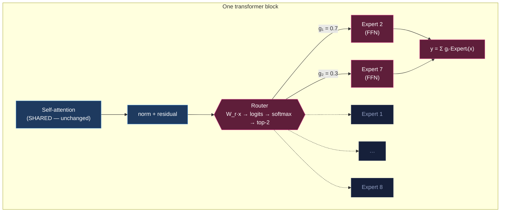
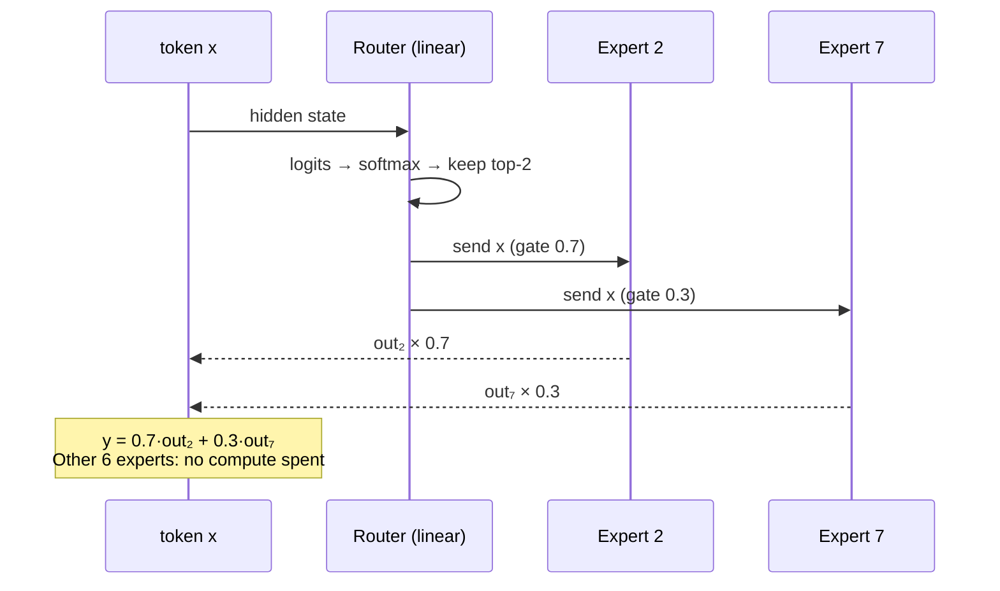
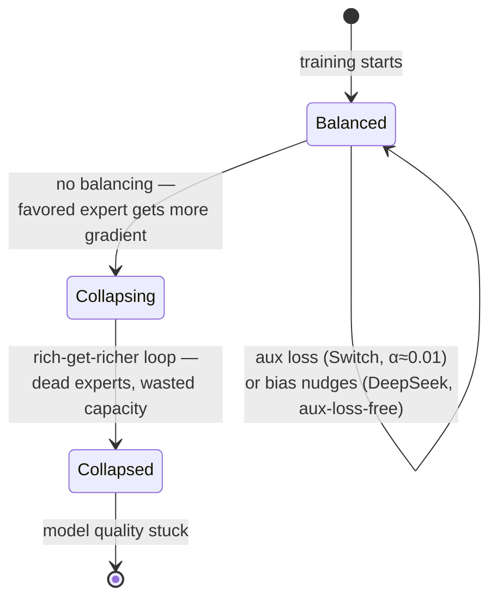

# The Mixture-of-Experts Track

## Problem Statement

Add **Mixture-of-Experts (MoE)** to the model types the site explains. The
[0004 roadmap](0004_[_]_NEXT_TRACKS_IMAGE_DIFFUSION.md) ranked MoE as a
high-reuse, timely next track: it is the architecture behind nearly every
2024+ frontier model (Mixtral, DeepSeek-V3/R1, Llama 4, Qwen3, Gemini 1.5,
gpt-oss), and pedagogically it is the purest demonstration of the site's
"shared spine + one swap" thesis — **the dense FFN inside each transformer
block forks into a router + many experts; attention never changes.**

This exploration specifies the track in enough detail to hand straight to
`/implement`: scenes, islands, data, and the honest caveats.

## Executive Summary

**Build a fourth live track, "Mixture of Experts," as ~10 scenes: the reused
spine (tokenize → embed → attention → …later… sample) plus six MoE scenes**
— the swap (highlighted core), routing, scale (total-vs-active parameters),
load balancing, and a myth-busting closer.

Three findings shape the design:

1. **The field has no interactive MoE explainer.** The two best-known
   interactive transformer explainers (Bycroft's LLM viz, Polo Club's
   Transformer Explainer) both stop at dense FFNs. The best existing teaching
   material is **static** — Maarten Grootendorst's "A Visual Guide to MoE"
   (50+ diagrams) — and its narrative order maps almost 1:1 onto our scene
   list. We animate what he draws. This track is genuinely novel territory.
2. **The one-swap hook is precisely accurate**, with one honest nuance: *which*
   blocks get the MoE FFN varies by model (Mixtral: all; Llama 4 Maverick:
   alternating; DeepSeek-V3: all but the first 3). Attention/embeddings/norms
   stay dense and shared everywhere.
3. **The misconceptions are the content.** Experts are *not* topic specialists
   (Mixtral's own paper found syntax/token-level patterns, not domains); MoE is
   *not* an ensemble (a token hits different experts at every layer); and memory
   scales with **total** params while compute scales with **active** — all three
   myths have verified sources and make great interactive reveals.

Five new islands: `MoEBlockSwap` (dense FFN splits into experts + router — the
highlighted core), `TokenRouter` (route a sentence token-by-token: logits →
softmax → top-2 weighted merge), `ActiveParams` (model picker; total-vs-active
bars from verified numbers), `LoadBalancer` ("break the router" — collapse vs
aux-loss vs DeepSeek bias balancing), and `MoEMyths` (three flip cards). All
zero-asset, SVG/DOM, following the established island conventions.

## Current State In The Repository

Live at `https://crs48.github.io/ai-explained/` with **three tracks**
(`reasoning-llm` order 1, `chat-llm` order 2, `image-diffusion` order 3 — all
`available: true`). The seams a new track touches, all proven twice now:

- **Tracks** — `src/content/tracks/*.json`: ordered `path` of
  `{ scene, highlight }`; the MoE track adds `moe-llm.json` with `order: 4`.
- **Scenes** — `src/content/scenes/*.mdx` (23 today). Reusable spine for MoE:
  `tokenize.mdx`, `embed.mdx`, `transformer-block.mdx` (attention — stays
  dense in MoE, which is the point), `sample.mdx` (works verbatim as "the rest
  of the pipeline is unchanged").
- **Islands** — 18 in `src/components/islands/`, keys in
  `registry.ts`, literal hydration tags in `SceneGraphic.astro`. MoE adds 5.
- **Rendering** — `TrackView.astro` + `SceneScaffold.astro` +
  `PipelineRail.tsx` (teal shared / magenta unique) + `TrackTabs.astro`
  (4 tabs still fit; the 0004 risk note about tab overflow triggers at ~5+).
- **Data** — `src/data/example.json`, `src/data/diffusion.json`; MoE adds
  `src/data/moe.json` (the verified model-numbers table drives `ActiveParams`).
- **Conventions** (learned the hard way in 0003/0004): read reduced-motion in
  `useEffect` never during render; no `Math.sin`/`Math.random` in render paths
  (SSR hydration); `suppressHydrationWarning` on controlled inputs; CSS-var
  colors only; `client:visible` via literal tags.

## External Research

Condensed from a verified research pass (primary sources fetched; ✓ = verified
this session, ⚠️ = flagged).

### Prior art

- **Grootendorst, "A Visual Guide to Mixture of Experts"** — the pedagogical
  gold standard (static). Order: what is MoE → experts (dense→sparse) → routing
  → load balancing → Switch → active-vs-sparse params with Mixtral as finale.
  **Steal:** the "dense layer cut into experts" morph; router softmax as a bar
  chart beside the expert stack; ending on active-vs-total params.
  https://newsletter.maartengrootendorst.com/p/a-visual-guide-to-mixture-of-experts
- **HF "Mixture of Experts Explained"** — canonical technical explainer;
  reproduces ST-MoE's expert-specialization table (punctuation/number experts —
  not "law experts") and states the memory misconception bluntly.
  https://huggingface.co/blog/moe
- **Raschka, "The Big LLM Architecture Comparison"** — the "everything is MoE
  now" survey; documents the trend from few large experts (Mixtral: 8) to many
  small ones (DeepSeek: 256, gpt-oss: 128).
  https://magazine.sebastianraschka.com/p/the-big-llm-architecture-comparison
- **mrzjy/expert_choice_visualization_for_mixtral** — colors tokens by which
  Mixtral expert served them; closest existing artifact to our routing scene.
- **OLMoE** (AllenAI) — fully open MoE with released routing analyses; the
  source to mine if we later want *real* routing data instead of curated.
  https://arxiv.org/abs/2409.02060
- **Interactive MoE explainers: none found.** Bycroft and Transformer Explainer
  are dense-only. (⚠️ a long-tail Observable notebook may exist.)

### Mechanics (scene-ready, verified)

- **The swap:** replace only the FFN sublayer with N expert FFNs + a router (one
  learned linear layer → N logits). Attention stays shared. Placement varies:
  Mixtral all 32 layers; GShard/Switch every other; DeepSeek-V3 all but first 3;
  Llama 4 Maverick alternating (✓ Meta blog quote).
- **Routing math (Mixtral form ✓):** logits ℓ = W_r·x; gates =
  Softmax(Top2(ℓ)); y = Σ gᵢ·Expertᵢ(x). Switch = top-1. DeepSeek-V3 uses
  **sigmoid** affinities, top-8, renormalized. Token-choice (all production
  LLMs) vs expert-choice (Zhou 2022) noted.
- **What experts learn (✓ Mixtral paper §5):** *no obvious topic/domain
  specialization* — ArXiv vs biology vs philosophy route similarly; structure is
  syntax/token-level (Python `self`, indentation whitespace cluster; consecutive
  tokens often share experts). ST-MoE: punctuation/number experts.
- **Load balancing:** router collapse (rich-get-richer death spiral, named in
  Shazeer 2017) → Switch aux loss L = α·N·Σ fᵢ·Pᵢ (α≈0.01) → DeepSeek's
  **aux-loss-free** per-expert bias, nudged down when overloaded / up when
  starved, used only for selection (✓ arXiv 2408.15664, 2412.19437).
- **Why it matters:** Mixtral matches/beats Llama 2 70B "with 6× faster
  inference" (✓ Mistral blog); Switch: 7× faster pretraining vs T5-Base;
  DeepSeek-V3 trained for ≈$5.6M — sparsity is central.

### Verified reference numbers (drives `src/data/moe.json`)

| Model | Total | Active | Experts/layer | Top-k | Shared expert |
|---|---|---|---|---|---|
| Mixtral 8×7B (12/2023) | 46.7B ✓ | 12.9B ✓ | 8 | 2 | no |
| DeepSeek-V3/R1 (12/2024) | 671B ✓ | 37B ✓ | 256 routed | 8 | yes (1) |
| Llama 4 Maverick (4/2025) | 400B ✓ | 17B ✓ | 128 routed | 1 routed | yes (1) ✓ |
| Qwen3-235B-A22B (4/2025) | 235B ✓ | 22B ✓ | 128 | 8 | no |
| gpt-oss-120b (8/2025) | 117B ✓ | 5.1B ✓ | 128 | 4 | no |
| GPT-4 (3/2023) | ~1.8T ⚠️ | ~280B ⚠️ | 16 ⚠️ | 2 ⚠️ | ? — **rumor, label clearly** |

Fun aside (✓): Mixtral "8×7B" ≠ 56B — experts share attention, so it's 46.7B.
The sparsity ratio narrative: Mixtral ~28% active → DeepSeek ~5.5% → gpt-oss
~4.4% — the industry keeps pushing it down.

### Timeline (for narration, not a dedicated scene)

1991 Jacobs/Jordan/Hinton adaptive mixtures → 2017 Shazeer sparsely-gated MoE →
2020 GShard (600B) → 2021 Switch (top-1, 1.6T) → 12/2023 Mixtral (open MoE
wave) → 12/2024 DeepSeek-V3 → 2025 Llama 4, Qwen3, Kimi K2, gpt-oss — the
"everything is MoE" era.

## Key Findings

1. **MoE is the purest "shared + 1" track yet** — even more than reasoning. The
   swap happens *inside* the transformer block we already teach; `tokenize`,
   `embed`, `transformer-block`, and `sample` are all reused verbatim, and
   `sample` doubles as the "everything downstream is unchanged" beat.
2. **We'd be first.** No interactive MoE explainer exists; Grootendorst's
   static guide validates the exact scene order; animating it is the value-add.
3. **Curated-but-truthful routing data.** Real Mixtral routing extraction is an
   offline job; the MVP uses hand-authored routing that reproduces the *findings*
   (whitespace/syntax clustering, consecutive-token locality), labeled
   illustrative — the same honesty stance as the attention heatmap.
4. **The misconception scene carries real teaching weight** (topic-specialist
   myth, ensemble myth, memory myth) and all three have quotable sources.
5. **Five islands, zero assets** — all SVG/DOM with curated data; no model
   downloads, no precompute pipeline. Cheapest flagship-quality track so far.

## Options And Tradeoffs

### Track naming

| Option | Pros | Cons |
|---|---|---|
| **"Mixture of Experts"** ⭐ | self-describing for lay readers | longest tab label |
| "MoE LLM" | short | jargon-first; meaningless to newcomers |

Four tabs still fit comfortably; revisit tab overflow at 5+ (0004 risk note).

### Where does `sample` go?

| Option | Pros | Cons |
|---|---|---|
| **After the MoE scenes, before myths** ⭐ | reinforces "rest of pipeline unchanged"; more teal in the rail | its closing line teases the reasoning track (fine — cross-links) |
| Omit it | tighter track | loses the completeness beat and reuse win |
| Right after `transformer-block` | canonical pipeline order | buries the swap; narratively worse |

### Routing data: real vs curated

| Option | Pros | Cons |
|---|---|---|
| **Curated, labeled illustrative** ⭐ | zero pipeline; reproduces verified findings | not literally real routings |
| Extract real Mixtral/OLMoE routings offline | truthful | offline GPU job + asset pipeline; defer as a documented follow-up |

### Load-balancing scene depth

| Option | Pros | Cons |
|---|---|---|
| **Collapse demo + aux-loss + DeepSeek bias toggle** ⭐ | the failure mode is visceral and the fix landscape is current | three modes to build |
| Collapse + aux loss only | simpler | misses the 2024+ state of the art |
| Skip capacity factor / dropped tokens | keeps scene focused | omits a real (but now-fading) detail — one footnote line instead |

## Recommendation

Ship the **"Mixture of Experts"** track as 10 scenes / 5 new islands:

| # | Scene | Kind | Island | Beat |
|---|---|---|---|---|
| 1 | `moe-intro` | shared | — | more capacity without more per-token compute; the one-swap promise |
| 2 | `tokenize` | reused | Tokenizer | — |
| 3 | `embed` | reused | EmbeddingSpace | — |
| 4 | `transformer-block` | reused | AttentionHeatmap | attention — which MoE *keeps* |
| 5 | `moe-swap` ⭐ | **unique, highlight** | **MoEBlockSwap** | dense FFN splits into 8 experts + router; Dense↔MoE toggle; attention glows "shared" |
| 6 | `moe-routing` | unique | **TokenRouter** | route a sentence token-by-token; logits→softmax→top-2 weighted merge; syntax-not-topics reveal |
| 7 | `moe-scale` | unique | **ActiveParams** | model picker; total-vs-active bars; sparsity-ratio story; GPT-4 rumor flagged |
| 8 | `moe-balance` | unique | **LoadBalancer** | streaming utilization histogram; balancing off → collapse; aux-loss vs DeepSeek-bias modes |
| 9 | `sample` | reused | SamplingPlayground | after the experts merge, everything proceeds as before |
| 10 | `moe-myths` | unique | **MoEMyths** | three flip cards + recap |

### The swap (the track's core diagram)



### Routing, per token



### Router collapse (the load-balancing scene)



## Example Code

### `src/content/tracks/moe-llm.json`

```json
{
  "title": "Mixture of Experts",
  "family": "language",
  "order": 4,
  "tagline": "How frontier models get huge without every token paying for it.",
  "available": true,
  "path": [
    { "scene": "moe-intro" },
    { "scene": "tokenize" },
    { "scene": "embed" },
    { "scene": "transformer-block" },
    { "scene": "moe-swap", "highlight": true },
    { "scene": "moe-routing" },
    { "scene": "moe-scale" },
    { "scene": "moe-balance" },
    { "scene": "sample" },
    { "scene": "moe-myths" }
  ]
}
```

### `src/data/moe.json` (verified numbers only)

```json
{
  "models": [
    { "name": "Mixtral 8×7B", "total": 46.7, "active": 12.9, "experts": 8, "topK": 2, "shared": 0 },
    { "name": "DeepSeek-V3", "total": 671, "active": 37, "experts": 256, "topK": 8, "shared": 1 },
    { "name": "Llama 4 Maverick", "total": 400, "active": 17, "experts": 128, "topK": 1, "shared": 1 },
    { "name": "Qwen3-235B", "total": 235, "active": 22, "experts": 128, "topK": 8, "shared": 0 },
    { "name": "gpt-oss-120b", "total": 117, "active": 5.1, "experts": 128, "topK": 4, "shared": 0 },
    { "name": "GPT-4 (rumor)", "total": 1800, "active": 280, "experts": 16, "topK": 2, "shared": 0, "rumor": true }
  ]
}
```

### TokenRouter gating (the live math, matching Mixtral's formulation)

```ts
// gates = Softmax(Top2(W_r · x)) — softmax over the top-k logits only
const top = [...logits.entries()].sort((a, b) => b[1] - a[1]).slice(0, 2);
const exps = top.map(([, l]) => Math.exp(l - top[0][1]));
const sum = exps.reduce((a, b) => a + b, 0);
const gates = top.map(([i], j) => ({ expert: i, gate: exps[j] / sum }));
// y = Σ gᵢ · Expertᵢ(x)
```

## Risks And Open Questions

- **Curated routing vs reality.** Mitigated by reproducing *verified findings*
  (syntax clustering, consecutive-token locality) and labeling "illustrative";
  real OLMoE/Mixtral routing extraction is a documented follow-up, not MVP.
- **Number drift.** Model specs move fast (late-2025/2026 releases unverified).
  All figures live in `moe.json` with a source per row — one file to update.
- **GPT-4 rumor.** Must render with an explicit "unconfirmed rumor" badge, or
  omit. Recommendation: include with badge — it's the model readers ask about.
- **Tab bar at 4 tracks.** Fits; the overflow/grouping work triggers at 5+.
- **`sample`'s closing line** teases the reasoning track from within the MoE
  track — acceptable cross-link, revisit if narration overrides land later.

## Implementation Checklist

- [x] Add `src/data/moe.json` with the verified model table (+ per-row source
      URLs, `rumor` flag for GPT-4).
- [x] Build `MoEBlockSwap` island (Dense↔MoE toggle; FFN splits into 8 experts
      + router; attention marked "shared — unchanged").
- [x] Build `TokenRouter` island (sentence tokens routed one-by-one: logit bars
      → softmax → top-2 arrows weighted by gate → merged output; a curated
      color-tokens-by-expert reveal showing syntax-not-topic clustering).
- [x] Build `ActiveParams` island (model picker from `moe.json`; total-vs-active
      bars; sparsity ratio readout; rumor badge for GPT-4).
- [x] Build `LoadBalancer` island (streaming expert-utilization histogram with
      three modes: no balancing → collapse; aux loss; DeepSeek bias).
- [x] Build `MoEMyths` island (three flip cards: topic-specialists / ensemble /
      memory — myth front, evidence back).
- [x] Register all five islands in `registry.ts` + `SceneGraphic.astro`.
- [x] Author scenes: `moe-intro`, `moe-swap`, `moe-routing`, `moe-scale`,
      `moe-balance`, `moe-myths` (reuse `tokenize`, `embed`,
      `transformer-block`, `sample` untouched).
- [x] Add `src/content/tracks/moe-llm.json` (order 4, `moe-swap` highlighted).
- [x] Reduced-motion + SSR-safety on every new island (per repo conventions).
- [x] Verify locally (build + browser pass over all 10 scenes), then ship:
      branch → PR → merge to `main` → deploy green.

## Validation Checklist

- [x] `astro build` emits `/moe-llm`; tab bar shows four live tracks.
- [x] The four reused scenes required **zero edits** (reuse proven again); rail
      dims them teal and highlights `moe-swap` magenta.
- [x] Dense↔MoE toggle visibly keeps attention untouched while the FFN forks.
- [x] TokenRouter: gates always sum to 1; top-2 arrows scale with gate weight;
      the token-color reveal clusters by syntax, labeled illustrative.
- [x] ActiveParams: numbers match `moe.json` (spot-check Mixtral 46.7/12.9 and
      DeepSeek 671/37); GPT-4 row carries the rumor badge.
- [x] LoadBalancer: "no balancing" visibly collapses to one expert; both fixes
      restore balance.
- [x] Production console clean across all MoE scenes; Lighthouse on `/moe-llm`
      ≥ 90 perf / ≥ 95 a11y.
- [x] A reader can restate: "MoE = the same transformer, but each block's FFN is
      replaced by a router picking a few experts — memory scales with total
      parameters, compute with active ones."

## References

- Grootendorst, A Visual Guide to MoE — https://newsletter.maartengrootendorst.com/p/a-visual-guide-to-mixture-of-experts
- HF, Mixture of Experts Explained — https://huggingface.co/blog/moe
- Raschka, The Big LLM Architecture Comparison — https://magazine.sebastianraschka.com/p/the-big-llm-architecture-comparison
- Mixtral of Experts — https://arxiv.org/abs/2401.04088 · https://mistral.ai/news/mixtral-of-experts
- DeepSeek-V3 — https://arxiv.org/abs/2412.19437 · DeepSeekMoE — https://arxiv.org/abs/2401.06066 · aux-loss-free balancing — https://arxiv.org/abs/2408.15664
- Llama 4 — https://ai.meta.com/blog/llama-4-multimodal-intelligence/ · Qwen3 — https://qwenlm.github.io/blog/qwen3/ · gpt-oss — https://openai.com/index/introducing-gpt-oss/ · https://arxiv.org/abs/2508.10925
- Switch Transformer — https://arxiv.org/abs/2101.03961 · GShard — https://arxiv.org/abs/2006.16668 · ST-MoE — https://arxiv.org/abs/2202.08906 · Sparsely-Gated MoE — https://arxiv.org/abs/1701.06538 · Expert-choice — https://arxiv.org/abs/2202.09368
- OLMoE — https://arxiv.org/abs/2409.02060 · Jacobs et al. 1991 — https://www.cs.toronto.edu/~hinton/absps/jjnh91.pdf
- GPT-4 MoE rumor (unconfirmed) — https://semianalysis.com/2023/07/10/gpt-4-architecture-infrastructure/
- Token-by-expert viz — https://github.com/mrzjy/expert_choice_visualization_for_mixtral
- Repo seams: `src/content.config.ts`, `src/content/tracks/*.json`, `src/components/islands/registry.ts`, `src/components/SceneGraphic.astro`
