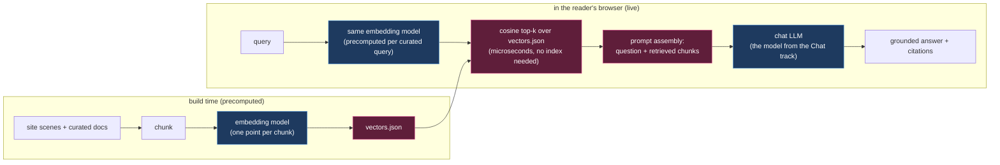
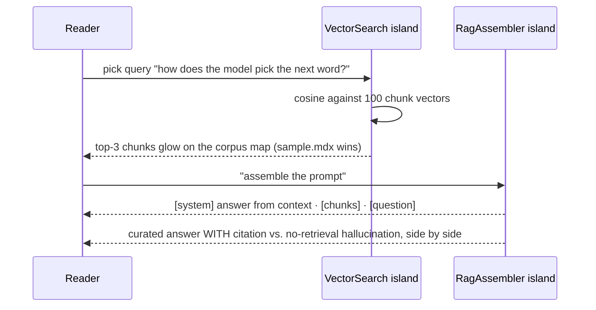

# Embeddings And RAG: The "Meaning As Geometry" Track

## Problem Statement

0004 ranked **Embeddings/RAG** as the next track after diffusion ("highest
reuse"); the Mixture-of-Experts track (0005) and the foundations/internals work (0006) pushed it back. Now
it's up. The gap it fills: every track *uses* embeddings (the shared `embed`
scene) but the site never explains the embedding **ecosystem** readers
actually touch every day — semantic search, "chat with your PDF,"
recommendations, vector databases, and **retrieval-augmented generation**,
the pattern behind nearly every "AI that knows *your* data" product.

It's also the site's first **system** track: RAG isn't a new model family,
it's a *composition* of two models the reader has already met (an embedding
model + a chat LLM) around a data structure (a vector index). That's a new
kind of story for the site — and the tab grouping shipped in 0006
(`TrackTabs.astro`) gives it a natural home.

Builds on [0002 taxonomy](0002_[_]_MODEL_TAXONOMY_AND_SHARED_SCENE_ARCHITECTURE.md),
[0004 roadmap](0004_[_]_NEXT_TRACKS_IMAGE_DIFFUSION.md), and
[0006 foundations/internals](0006_[x]_FOUNDATIONS_AND_LLM_INTERNALS_TRACKS.md).

## Executive Summary

Build **one track, "Search by Meaning" (embeddings + RAG)**, ~8 scenes, that
runs the arc: *meaning is geometry → measure closeness → embed whole
sentences → search by distance → stuff what you found into a prompt → what
breaks*. Maximum spine reuse as promised: it opens by **referencing the
existing `embed` scene's island** (`EmbeddingSpace`) with track-specific
narration (the `text-encoder.mdx` wrapper pattern from 0004), and its RAG
finale reuses the mental model of the chat track.

The centerpiece decision mirrors 0004's precompute stance: **live in-browser
embedding is feasible but heavy** (transformers.js + all-MiniLM-L6-v2 is a
~25 MB quantized download — tractable, but not core-path material on a
static site). So: **precompute a small document corpus's embeddings at build
time** (extending `scripts/precompute.mjs`), ship them as JSON, and do
**live vector search** (cosine over a few hundred 384-d vectors is
microseconds in JS). An optional "embed your own query for real" island can
load transformers.js behind a click, exactly like the LLM track's
`LiveModel` and the steering scene's Neuronpedia iframe.

## Current State In The Repository

- **Shared spine to reuse** — `src/content/scenes/embed.mdx` +
  `src/components/islands/EmbeddingSpace.tsx` (word-level, curated neighbors,
  king−man+woman demo). The new track wraps this island in new narration
  (wrapper-scene pattern proven by `text-encoder.mdx`).
- **Wrapper-scene precedent** — `src/content/scenes/text-encoder.mdx`
  (diffusion) re-frames a shared island; `TrackLink.astro` (0006) links
  across tracks.
- **Precompute seam** — `scripts/precompute.mjs` already generates
  `src/data/example.json`; the corpus embeddings extend this script (or a
  sibling `scripts/embed-corpus.mjs` run manually, committed output).
- **Track slot** — `src/content/tracks/` + `TrackTabs.astro` `GROUPS`: add
  family `"systems"` under a new group (label: `"systems"` or fold into
  `"language"`). `order: 6`.
- **Live-model precedent** — `LiveModel.tsx` (transformers.js text-gen behind
  a click) is the exact pattern for optional live embedding.
- **Data budget** — 300 docs × 384 dims × float32 ≈ 460 KB raw; quantize to
  int8 or keep 2-decimal floats in JSON (~250 KB gzipped ≈ fine). Or 128-d
  PCA-reduced (~85 KB) since the lesson survives dimensionality reduction —
  decide during implementation.

## External Research

(Condensed; primary sources in References.)

- **Prior art for teaching embeddings:** TensorFlow Embedding Projector
  (PCA/t-SNE/UMAP fly-through of real embeddings); Jay Alammar's *Illustrated
  Word2Vec* (the canonical analogy-arithmetic visuals — our `EmbeddingSpace`
  already covers this ground); Vicki Boykis's *What are embeddings*
  (free book; the systems framing); Nomic Atlas (map-of-a-corpus UX worth
  imitating at toy scale for the corpus scene).
- **RAG origin & framing:** Lewis et al. 2020 coined RAG; modern practice is
  the simpler "retrieve → stuff the prompt → generate" (in-context RAG). The
  teachable pipeline: chunk → embed → index → (query → embed → top-k by
  cosine) → prompt assembly → generation with citations.
- **The honest caveats worth teaching** (they're the "aha" content):
  embedding similarity ≠ truth (nearest neighbor can be topically close and
  factually wrong); chunking choices dominate quality; retrieval failure →
  confident hallucination; "lost in the middle" (models attend poorly to
  mid-prompt context); embeddings are one-way lossy (can't reconstruct text),
  but *can* leak (inversion attacks recover a lot — worth one honest line).
- **In-browser feasibility:** transformers.js `feature-extraction` with
  `Xenova/all-MiniLM-L6-v2` (384-d) is the standard: ~25 MB quantized ONNX,
  ~50–200 ms/query on desktop CPU. Fine as an opt-in island; wrong as a
  core-path dependency (mobile data, cold cache). Cosine top-k over ≤1k
  vectors needs no index — brute force in a few hundred microseconds;
  teaching HNSW/ANN is a narration aside, not a component.

## Key Findings

1. **This track's "new core" is a system diagram, not a new network.** The
   novelty for readers: models can be *composed* — embedding model as
   librarian, LLM as writer. That framing (two models you already met,
   working a pipeline) is the track's version of diffusion's "new engine."
2. **Live search over precomputed vectors gives 90% of the magic at 0% of
   the download.** Typing a query and watching neighbors light up *feels*
   live even when the query is picked from curated options; a real
   type-anything mode needs the optional transformers.js island.
3. **Sentence embeddings need their own scene.** `EmbeddingSpace` teaches
   word geometry; the leap to "a whole paragraph is one point" (mean pooling
   / CLS, contrastive training on paired texts) is the conceptual step
   readers miss most.
4. **RAG's failure modes are the differentiating content.** Every vendor
   demo shows RAG working; almost nobody *shows* retrieval missing and the
   LLM confabulating anyway. We can, safely, with curated examples — the
   same honesty franchise as `faithfulness.mdx`.
5. **A "systems" family future-proofs the taxonomy** — agents/tool-use is the
   obvious next systems track, so the group won't be a singleton forever.

## Options And Tradeoffs

### Corpus for the demo

| Option | Pros | Cons | Verdict |
|---|---|---|---|
| **This site's own scenes as documents** ⭐ | self-referential delight ("search the site you're reading"); zero licensing; genuinely useful | small corpus (~35 chunks) — pad with curated extras | **Do it**, pad to ~100 chunks with public-domain trivia paragraphs |
| Wikipedia intro paragraphs | familiar, factual | licensing fine (CC-BY-SA) but attribution plumbing; blandness | fallback |
| Synthetic mini-wiki | full control | fake-feeling; effort | no |

### Query handling in the search scene

| Option | Pros | Cons |
|---|---|---|
| **Curated query set (precomputed query embeddings)** ⭐ core | instant, deterministic, works everywhere | can't type free text |
| Optional transformers.js island for free text | real magic, "embed anything" | 25 MB opt-in download; desktop-biased |
| Server/API | — | violates static-hosting constraint |

Recommendation: curated queries on the core path, `LiveEmbed` island as the
track's optional finale-adjacent bonus (same stance as `LiveModel`).

### Where RAG's generation step comes from

| Option | Pros | Cons |
|---|---|---|
| **Curated generations (with/without retrieval, good/failed retrieval)** ⭐ | shows success AND failure honestly; zero runtime cost | authored, must be labeled illustrative |
| Reuse `LiveModel` (transformers.js LLM) for real generation | real end-to-end RAG in browser | tiny models make RAG look *worse* than it is; heavy |

## Recommendation

**Track: "Search by Meaning"** — `family: "systems"`, `order: 6`, new
`TrackTabs` group `systems`. Path:

| # | Scene | Kind | Island | Beat |
|---|---|---|---|---|
| 1 | `rag-intro` | unique | — | "How does an AI answer questions about *your* documents? Two models you've already met, plus geometry." |
| 2 | `embed-meaning` | shared-wrapper | `EmbeddingSpace` (reused) | recap word geometry from the LLM tracks' embed scene |
| 3 | `sentence-embed` | unique | `SentenceSpace` | whole sentences/paragraphs become single points; paraphrases cluster, antonyms split |
| 4 | `similarity` | unique | `CosineCompass` | cosine similarity: angle, not distance; interactive two-vector dial |
| 5 | `vector-search` ⭐ | unique | `VectorSearch` | the site's own scenes as a searchable corpus; query → top-k lights up on a 2D map |
| 6 | `rag-pipeline` | unique | `RagAssembler` | watch the prompt get assembled: query + retrieved chunks → the chat model answers *with citations* |
| 7 | `rag-fails` | unique | `RagFailures` | the honest scene: bad chunking, missed retrieval → confident nonsense; fixes (rerank, better chunks) |
| 8 | `rag-recap` | unique | — | systems framing: librarian + writer; where this shows up in your life; bridge to agents (future) |





## Example Code

```json
// src/content/tracks/search-by-meaning.json
{
  "title": "Search by Meaning",
  "family": "systems",
  "order": 6,
  "tagline": "Embeddings turn meaning into geometry — and RAG turns your documents into something an LLM can actually know.",
  "available": true,
  "path": [
    { "scene": "rag-intro" },
    { "scene": "embed-meaning" },
    { "scene": "sentence-embed" },
    { "scene": "similarity" },
    { "scene": "vector-search", "highlight": true },
    { "scene": "rag-pipeline" },
    { "scene": "rag-fails" },
    { "scene": "rag-recap" }
  ]
}
```

```js
// scripts/embed-corpus.mjs (run manually; commit the JSON output)
// 1. read src/content/scenes/*.mdx → strip frontmatter/markdown → chunk ~80 words
// 2. embed with @huggingface/transformers feature-extraction (all-MiniLM-L6-v2)
// 3. PCA → 2D coords for the map + keep full vectors (or 128-d) for search
// 4. embed the ~10 curated queries too
// 5. write src/data/corpus.json { chunks: [{id, track, text, vec, x, y}], queries: [...] }
```

```ts
// VectorSearch core (island): brute-force cosine, no index, no deps
const score = (q: number[], v: number[]) => {
  let dot = 0, nq = 0, nv = 0;
  for (let i = 0; i < q.length; i++) { dot += q[i] * v[i]; nq += q[i] ** 2; nv += v[i] ** 2; }
  return dot / (Math.sqrt(nq) * Math.sqrt(nv));
};
const topK = chunks.map((c) => ({ c, s: score(queryVec, c.vec) }))
  .sort((a, b) => b.s - a.s).slice(0, 3);
```

## Risks And Open Questions

- **Corpus self-reference cuts both ways** — searching the site's own scenes
  is delightful but the corpus is homogeneous (all AI explainers), which can
  make *every* query look like a good match. Mitigate by padding with ~60
  off-topic public-domain chunks so misses exist and `rag-fails` has real
  material.
- **Embedding JSON size** — measure; if >300 KB gzipped, PCA to 128-d or
  int8-quantize (both preserve top-k ordering well enough at toy scale;
  verify overlap@3 against full vectors in the embed script).
- **Curated generations must not oversell** — label authored answers
  illustrative (0006's franchise); the failure scene is the credibility
  anchor.
- **`embed-meaning` wrapper vs. plain reuse** — reusing `embed.mdx` verbatim
  mid-track re-numbers oddly ("Step 2 — Embed" inside a systems track).
  Wrapper scene with fresh narration is one file; decide at build time.
- **transformers.js version drift** — `LiveModel` already pins the pattern;
  reuse its loader/version to avoid two copies of the dependency.

## Implementation Checklist

- [ ] `scripts/embed-corpus.mjs`: chunk site scenes + curated padding docs,
      embed (all-MiniLM-L6-v2), PCA to 2D for the map, write
      `src/data/corpus.json` (+ curated query embeddings; log gzipped size).
- [ ] Author scenes: `rag-intro`, `embed-meaning` (wraps `EmbeddingSpace`),
      `sentence-embed`, `similarity`, `vector-search` (highlight),
      `rag-pipeline`, `rag-fails`, `rag-recap`.
- [ ] Build islands: `SentenceSpace`, `CosineCompass`, `VectorSearch`
      (corpus map + live cosine top-k), `RagAssembler` (prompt assembly +
      curated with/without-retrieval outputs), `RagFailures`.
- [ ] Register islands in `registry.ts` + `SceneGraphic.astro`.
- [ ] Add `search-by-meaning.json` (`order: 6`) and a `systems` group to
      `TrackTabs.astro` `GROUPS`.
- [ ] (Optional) `LiveEmbed` island: transformers.js free-text query
      embedding behind a click, reusing `LiveModel`'s loading pattern.
- [ ] Reduced-motion + SSR-safe per house rules; curated outputs labeled
      illustrative with citations.

## Validation Checklist

- [ ] `astro build` emits `/search-by-meaning`; tab bar shows the `systems`
      group; Lighthouse ≥ 90/95 holds.
- [ ] Every curated query's top-3 chunks are sensible (spot-check all), and
      at least one padding-corpus query demonstrably *misses* for `rag-fails`.
- [ ] Corpus JSON ≤ ~300 KB gzipped (or reduced till it is) and top-3 overlap
      vs. full-precision vectors ≥ 90% if quantized/reduced.
- [ ] A reader can articulate: "RAG = embed my documents as points, embed my
      question, grab the nearest chunks, and hand them to the chat model —
      and when retrieval misses, the model can still bluff."
- [ ] Cross-links: `embed.mdx` ↔ this track (TrackLink), `rag-recap` →
      chat track.

## References

- Lewis et al., "Retrieval-Augmented Generation" (2020) — https://arxiv.org/abs/2005.11401
- "Lost in the Middle" (Liu et al. 2023) — https://arxiv.org/abs/2307.03172
- Vicki Boykis, *What are embeddings* — https://vickiboykis.com/what_are_embeddings/
- Jay Alammar, Illustrated Word2Vec — https://jalammar.github.io/illustrated-word2vec/
- TensorFlow Embedding Projector — https://projector.tensorflow.org/
- Sentence-Transformers (SBERT) — https://sbert.net/ · all-MiniLM-L6-v2 — https://huggingface.co/sentence-transformers/all-MiniLM-L6-v2
- transformers.js feature-extraction — https://huggingface.co/docs/transformers.js
- Nomic Atlas (corpus-map UX) — https://atlas.nomic.ai/
- Text-embedding inversion (leakage caveat) — https://arxiv.org/abs/2310.06816
- Repo seams: `src/content/scenes/embed.mdx`, `src/components/islands/EmbeddingSpace.tsx`, `src/components/islands/LiveModel.tsx`, `scripts/precompute.mjs`, `src/components/TrackTabs.astro`, `src/components/TrackLink.astro`
